# Working with Jenkins

[Jenkins](https://jenkins.io/) is a very popular Java based, open source continuous integration server that allows teams to continuously build applications across platforms.

Visual Studio Team Services(VSTS) includes Team Build, a native CI build server that runs on Windows, Linux, Mac and allows building any application on these platforms. However, it also integrates well with Jenkins for teams who prefer to use Jenkins for CI. 

This lab shows how you can integrate Team Services and Jenkins. In this lab, we will see how you can:
 * Provision Jenkins on Azure with an Azure Marketplace Template VM
 * Setup a Jenkins build
 * Configure Team Services to trigger Jenkins upon code change
 * Setup Release Management in VSTS to deploy artifacts from Jenkins

## Pre-requisites

1. Microsoft Azure Account:</b> You will need a valid and active azure account for the lab.

1. You need a **Visual Studio Team Services Account** and <a href="http://bit.ly/2gBL4r4">Personal Access Token</a>

1. You will need [Putty](http://www.putty.org/), a free SSH and Telnet client

## Setting up the project

1. Use <a href="https://vstsdemogenerator.azurewebsites.net" target="_blank">VSTS Demo Data Generator</a> to provision a project on your VSTS account 

 2. Select **MyShuttleJenkins** for the template


## Setting up Jenkins VM

1. Let's set up Jenkins. We will use the VM image available on Azure MarketPlace that will install the latest stable Jenkins version on an Ubuntu Linux VM along with tools and plugins configured to work with Azure.

    <a href="https://portal.azure.com/#create/azure-oss.jenkinsjenkins" target="_blank">
    
    </a>
 
1. Once the machine is provisioned, click **Connect** and note down the \<username> and \<ip address>. We will need this to connect to the VM from ***Putty***

    

1. You will notice that by default the instance listens on port 8080 using HTTP. If you want to set up HTTPS communication, you will need to provide an SSL certificate. If you do not setup HTTPS communication, the best way to make sure the sign-in credentials are not leaked due to a "Man-in-the-middle" attack is to only log in using SSH tunneling. An SSH tunnel is an encrypted tunnel created through an SSH protocol connection, which can be used to transfer unencrypted traffic over an unsecured network. Simply run this command from a command prompt. 

  >**Note:** You should have Putty.exe in the path or provide the absolute path to the command
    ````
    putty.exe -ssh -L 8080:localhost:8080 <username>@<ip address>
    ````
    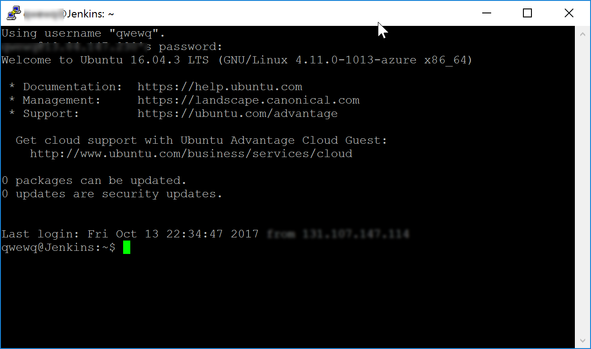

1. Login with the user name and password that you provided when you provisioned the VM.

1. Once you are connected successfully, open a browser and type [http://localhost:8080](http://localhost:8080)

1. You will need to provide the initial admin password that Jenkins generates and saves it in a file on the server. 
    

1. Return to the **Putty** terminal password and type the following command to open the file that has the initial admin password. Copy the text
    >sudo vi /var/lib/jenkins/secrets/initialAdminPassword

    *You can double click on the line and use **CTRL+C** copy the text and place it in the clipboard. Press **ESC and then :q!** to exit the vi editor without saving the file*

1. Back in the browser, paste the text and select **Continue**  

    


 **Note:** The next three steps might not be necessary in most cases as Jenkins on Azure is now automatically configured with the default options but should you need to configure further, here are the steps

  Jenkins has a large ecosystem with a strong and active open source community users contributing several hundreds of useful plugins. When you setup Jenkins, you can start with installing the most commonly used plugins or select and install the ones that you want.

1. You will need the Maven plug-in which is not installed by default but we will do it later. For now, we will go with the suggested plugins. Select **Install suggested plugins**

    

1. You will need to create a new *Admin* user for Jenkins. Provide a user name and password and select **Continue**

    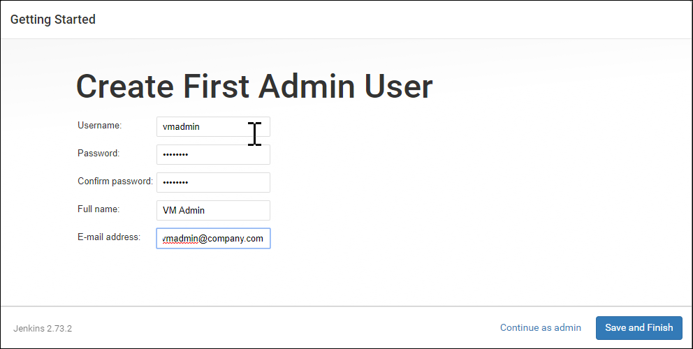

1. Now, you have Jenkins ready to use. Select **Start using Jenkins**

    

## Installing and configuring Maven

 Starting from Jenkins version 2, Maven plugin is not installed by default.  You will need to do this manually

1. Select **Manage Jenkins** on the main page of the Jenkins portal.  This will take you to the Manage Jenkins page, the central one-stop-shop for all your Jenkins configuration. From this screen, you can configure your Jenkins server, install and upgrade plugins, keep track of system load, manage distributed build servers, and more!

1. Select **Manage Plugins**

    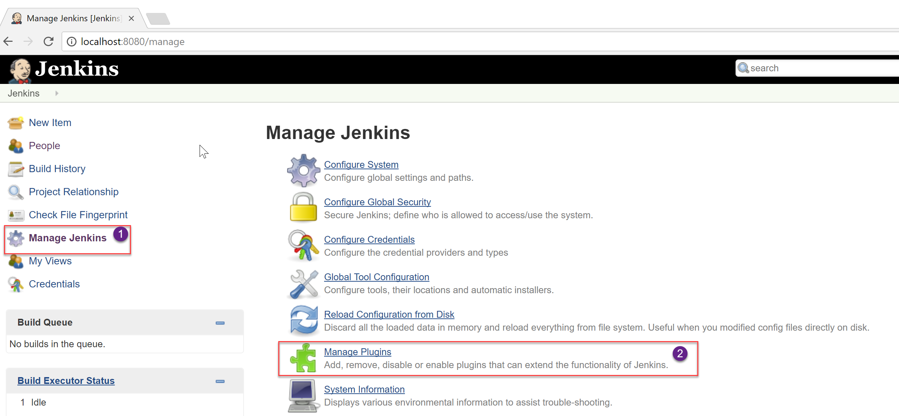

1. Select **Available** tab and search **maven-plugin** in the filter box

1. Check **Maven Integration Plugin** and select **Install without restart** to install the plugin. Wait for the plug-in to be installed.

    

1. Select **Manage Jenkins** and select **Global Tool Configuration**

    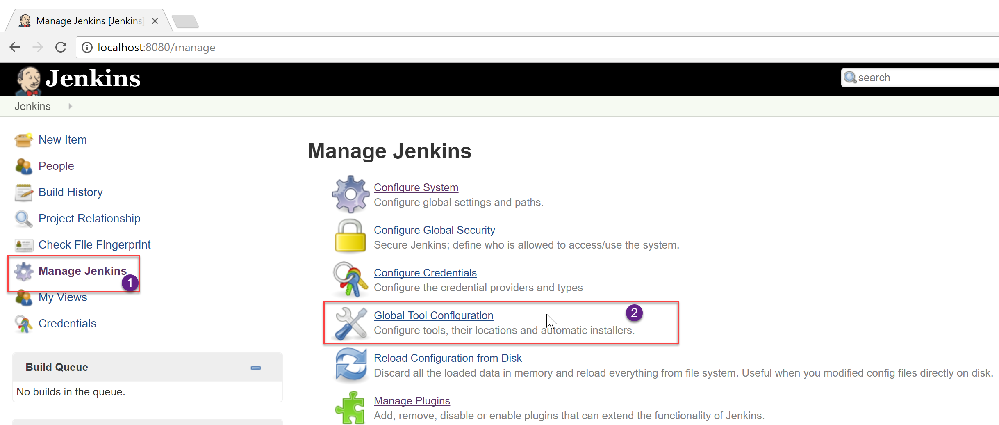

1. You have added the Maven plugin for Jenkins but you have not installed Maven on the machine. Jenkins provides great out-of-the-box support for Maven.  You could  manually install Maven by extracting the ***tar*** file located in a shared folder. Alternatively, you can let Jenkins do all the hard work and download Maven for you. Select the **Install automatically** checkbox. Jenkins will download and install Maven from the Apache website the first time a build job needs it. 

    We will install version 3.5, the latest version at the time the lab is written

    

1. Click **Apply** and select **Back to Dashboard** to return to the home page. 

## Creating a new Build Job

1. From Jenkins home page, select **New Item**. Enter a name for the build definition, and select **Maven project**. Click **OK** to save 
    

 1.Scroll down to the **Source code Management** section. Select **Git** and Enter the clone URL of your VSTS Git repo. It should be in http://\<your account name>.visualstudio.com/
 \<your project name>/_git/MyShuttle

   

**Note:** VSTS Git repos are private. So you will need to provide the credentials to access the repository. If you have not set the Git credentials, you can do it from VSTS


1. Select **Add | Jenkins** to add a new credential. Save the user name and password and click **Add** to close the wizard
    

1. Select the credential from the drop-down. The error message should disappear now 
    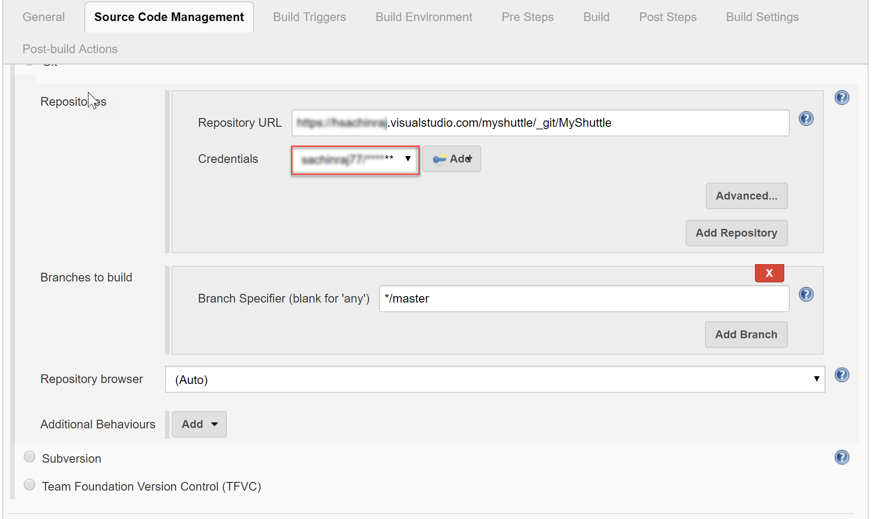

1. The source code for this application has both unit tests and UI tests. We will include the unit tests but skip the UI tests from running now.

1. Scroll down to the **Build** section. Enter the following text in the **Goals and Options** field

    >package -Dtest=FaresTest,SimpleTest

1. Click **Save** to navigate to the main page of the project you just created
    

1. The last configuration that we will do for this lab is to add a *Post-build* action to publish the artifacts. Scroll down to **Post-Build Actions**  section, click **Add post-build action** and select **Archive the artifacts**
    

1. Enter  **target/*.war** in the text box. Click **Save** to save the settings and return to the project page
    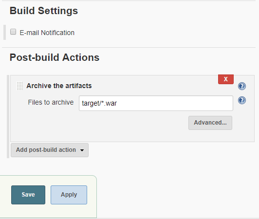

1. We have completed all the necessary configuration and Select **Build Now** to start an Ad-hoc build

1. You will notice the build progress just below the left side navigation menu
    

1. You can select the build number to get into the details of the build including the build artifacts, in this case, the WAR file for the project.
    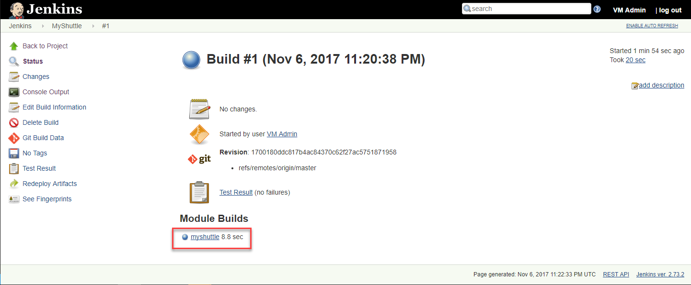
    

1. Select the **Test Results** links if you want to see the results of the unit tests that were included in the build definition. 

## Configuring the build as Continuous Integration

In this section, let's see how you can configure a code change in VSTS to trigger a build in Jenkins

1. Go to your VSTS project page and navigate to the admin  **Service Hooks** page

    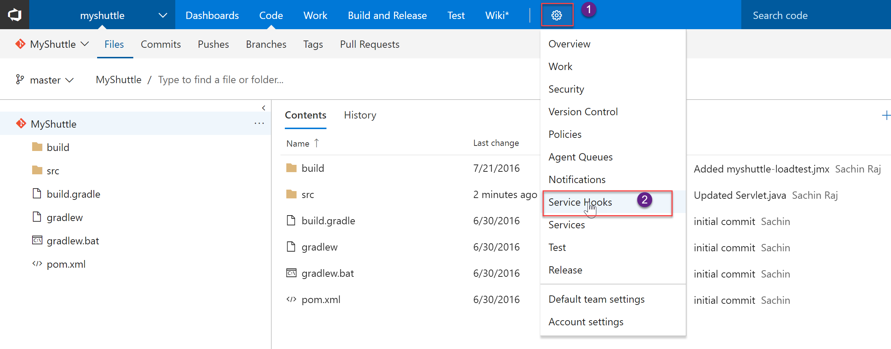

1. Select **Create subscription** button

1. In the *New subscriptions dialog* select **Jenkins** and click **Next**
    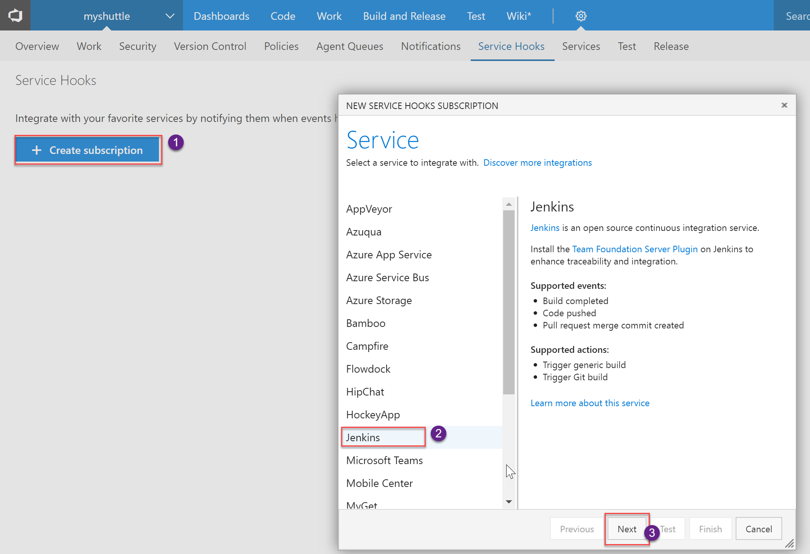

1. Select **Code pushed**  for the **Trigger on this of type event**

1. Make sure you have selected the **MyShuttle** (or the correct repo) for which you have configured the build

1. Select **Next**

    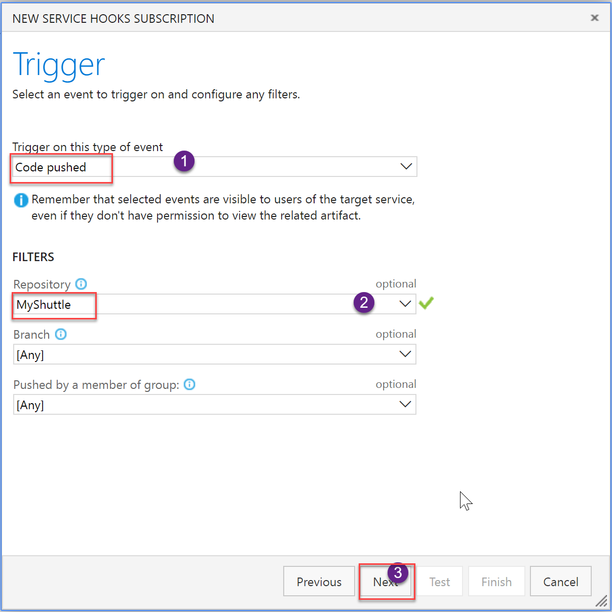

1. In the next page, select **Trigger generic build** for the perform action field

1. Enter the URL of the Jenkins server in **http://ipaddress** or domain name format

1. Enter **User name** and **Password** that you have setup for Jenkins

1. Select **Test** to check the settings. If the settings are correct, click **Finish** to save and exit
    
    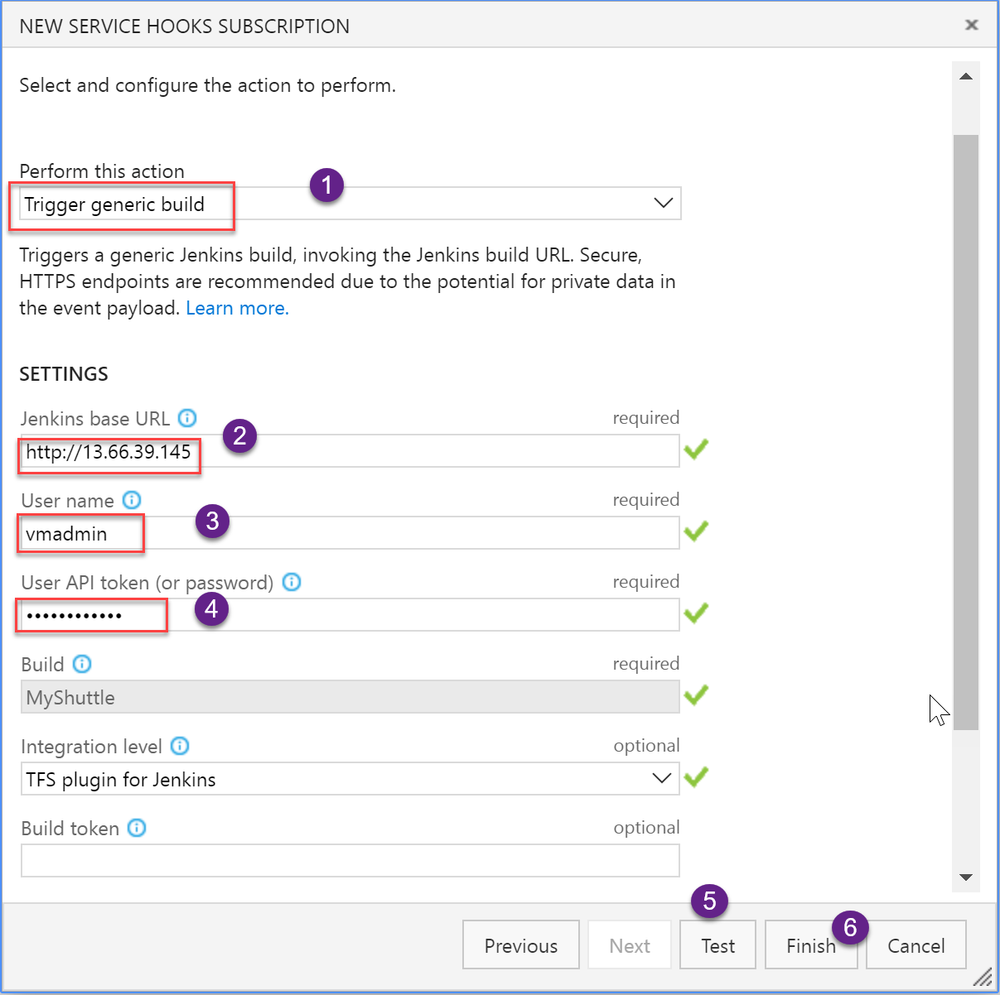

Now you can try making a change and commit your code. Upon commit, VSTS will notify Jenkins to initiate a new build.


## Deploying Jenkins Artifacts with Release Management

You can Visual Studio Team Services Release Management to fetch the artifacts from the Jenkins server and deploy them. In this exercise below, we will configure VSTS to deploy the WAR file to Azure Web App Service. 

1. First, you will need to create an endpoint to Azure and the Jenkins server. From the **Admin | Services** tab, select the **New Service Endpoint | Jenkins** button to create a new endpoint

2. Provide the server URL and the user name and password (the credentials you provided for the first admin user). The server URL is in http://[server IP address or DNS name] format. Click **Verify Connection** to validate the entries and to confirm that VSTS is able to reach the Jenkins server
    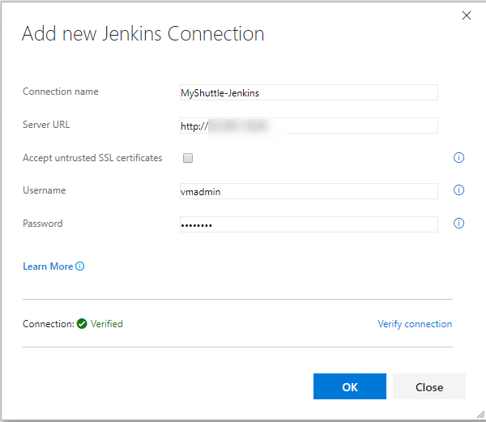

    You are now ready to create a new release definition. 

1. Select the **Build & Release** hub and select **+ Create a new Release definition** to start creating a new release definition

1. We will use the **Azure App Service Deployment** template as we are trying to publish a web application
    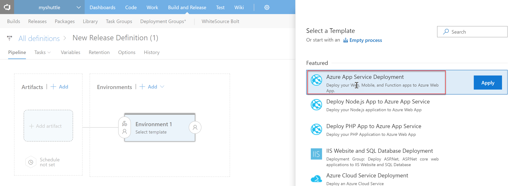

1. We will name the default environment as **Dev**
    

1. We will link this release definition to the MyShuttle build on Jenkins. Select **+Add** to add an artifact

1. Select **Jenkins** for the *Source type*. Select the Jenkins endpoint you created above and enter **MyShuttle** for the *Source(Job)* - Note this should map to the project name that you have configured in Jenkins

1. If you have configured Jenkins server and the source correctly, you will get a message showing the output of the build, in this case it should be ***myshuttledev.war***
    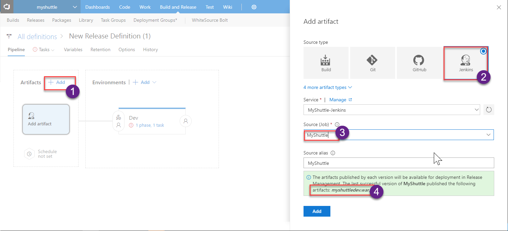

1. You are now ready to deploy!

1. You can refer to the [Deploying Tomcat+MySQL application to Azure with VSTS]() if you want to continue with the deployment.

## Feedback

We will appreciate your feedback. Please send your feedback and suggestions to [devopsdemos@microsoft.com](mailto:devopsdemos@microsoft.com)
