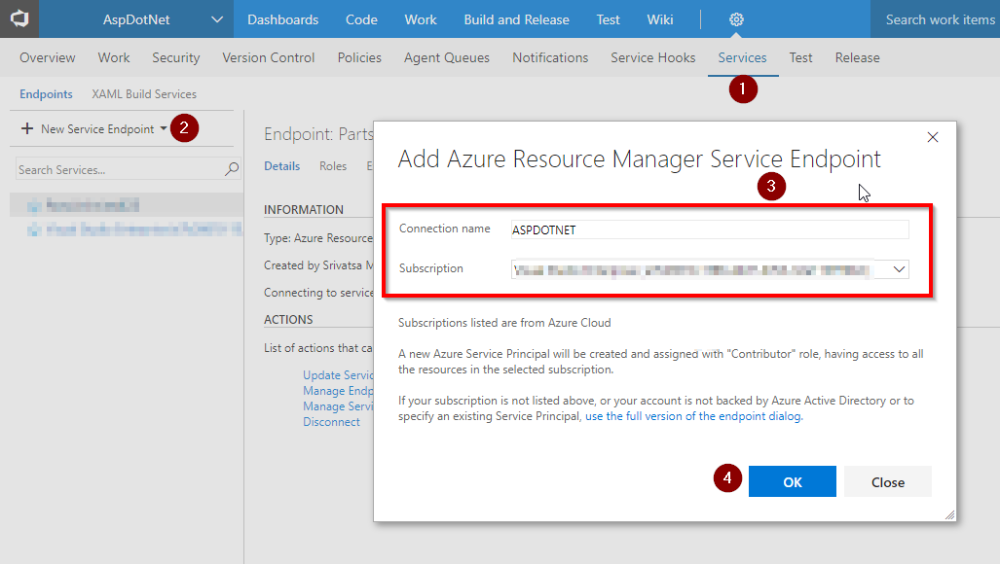
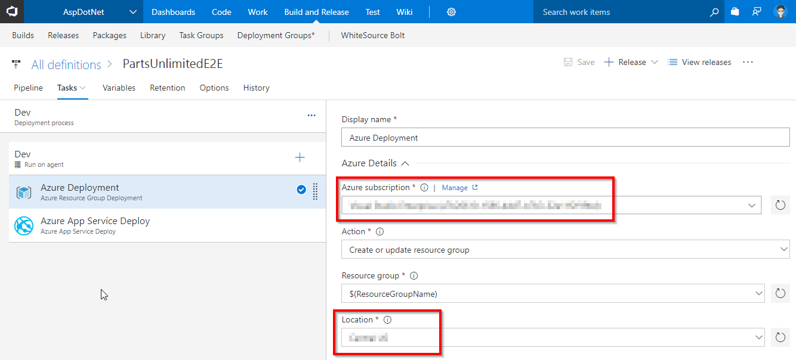
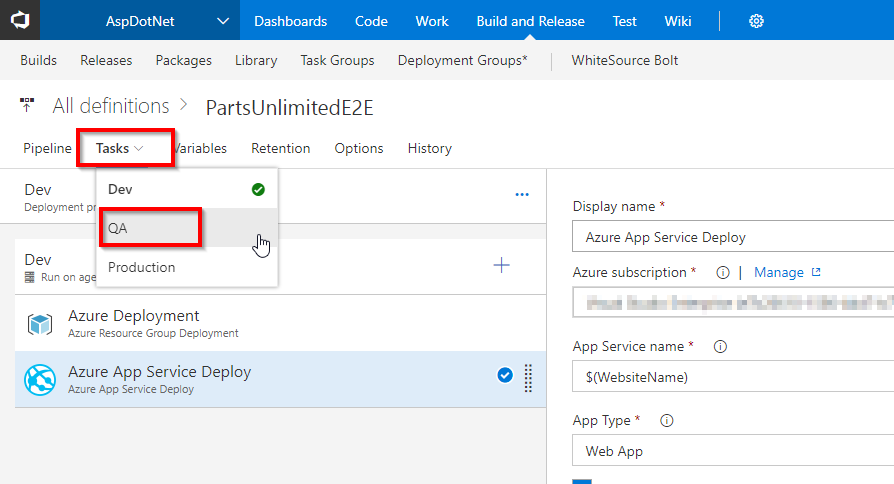
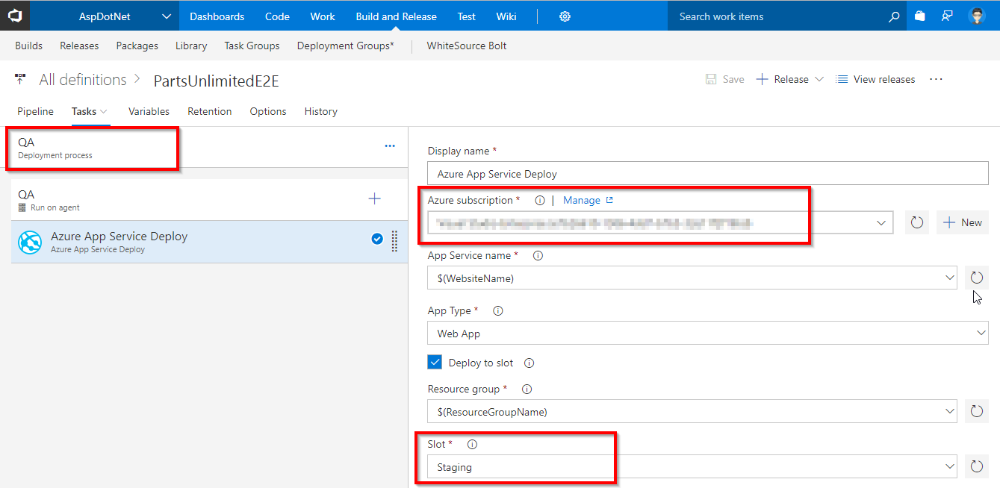
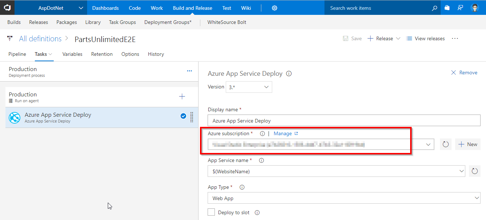
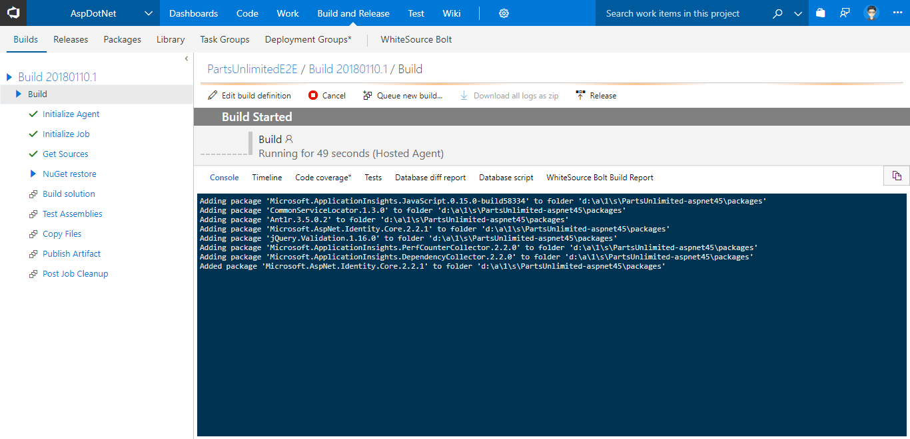
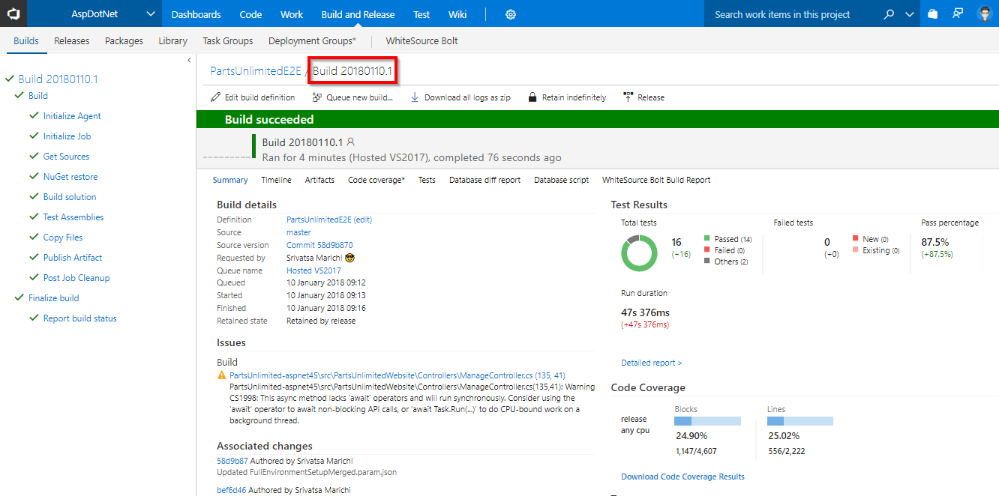
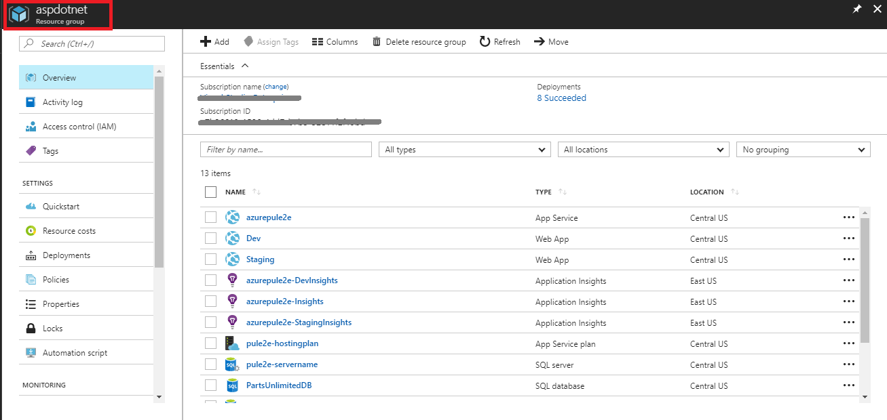

# Deploy ASP.NET application to Azure App Service using VSTS

This lab shows how to deploy an [ASP.NET](https://www.asp.net/) application to Azure App Service with Visual Studio Team Services.

## Overview

ASP.NET is an open source web framework for building modern web apps and services. ASP.NET creates websites based on HTML5, CSS, and JavaScript that are simple, fast, and can scale to millions of users.

## Pre-requisites

1. **Microsoft Azure Account:** You will need a valid and an active azure account for this lab.

2.You need a **Visual Studio Team Services Account** and [Personal Access Token](https://docs.microsoft.com/en-us/vsts/accounts/use-personal-access-tokens-to-authenticate)

## Setting up the VSTS Project

1. Use [VSTS Demo Data Generator](https://vstsdemogenerator.azurewebsites.net/?name=PartsUnlimited) to provision the project on your VSTS account.

   

1. Once the project is provisioned, click the URL to navigate to the project.

   

## Exercise 1: Endpoint Creation

Since the connections are not established during project provisioning, we will manually create the endpoints.

In VSTS, navigate to **Services** by clicking the gear icon  and click **+ New Service Endpoint**. Select **Azure Resource Manager**. Specify **Connection name**, select your **Subscription** from the dropdown and click **OK**. We use this endpoint to connect **VSTS** with **Azure**.

   

   You will be prompted to authorize this connection with Azure credentials.

> **Note**: Disable pop-up blocker in your browser if you see a blank screen after clicking OK, and retry the step.

## Exercise 2: Configure Release

Now that connections are established, we will manually map the endpoints to release definition.

>**Note** : You will encounter an error - **TFS.WebApi.Exception: Page not found** for Azure tasks in the release definition. This is due to a recent change in the VSTS Release Management API. While we are working on updating VSTS Demo Generator to resolve this issue, you can fix this by typing a random text in the **Azure Subscription** field and click the **Refresh** icon next to it. Once the field is refreshed, you can select the endpoint from the drop down.

1. Go to **Releases** under **Build & Release** tab, edit the release definition **PartsUnlimitedE2E**.

   

1. Select **Tasks** and click **Dev**.

   

1. Under **Azure Resource Group Deployment** task, update **Azure subscription** with the endpoint components from the dropdown and select the desired **location**.

   

1. Under **Azure App Service Deploy** task, update **Azure subscription** with the endpoint components from the dropdown. Under the **Slot** section enter the slot name as **Dev**.

   

1. Similarly update **Azure subscription** with the endpoint components for **QA** and **Production** environments. Go to **Tasks** and select **QA**.

   

1. Under **Azure App Service Deploy** task, update **Azure subscription** with the endpoint components from the dropdown. Under the **Slot** section enter the slot name as **Staging**.

   

1. Go to **Tasks** and select **Production**.

   

1. Under **Azure App Service Deploy** task, update **Azure subscription** with the endpoint components from the dropdown and click **Save** to save the release definition.

   

## Exercise 3: Update Code

We will update the code to trigger CI-CD.

1. Go to the **Code** hub.

   

1. We have an **ASP.NET** app code provisioned by the demo generator system. We will deploy this to Azure app service.

1. We have a Continuous Integration (CI) build setup to run upon a code commit. Let's make a simple change to the code to trigger the CI build.

1. Open the file **Index.cshtml** by navigating to the below path-

   > **PartsUnlimited-aspnet45/src/PartsUnlimitedWebsite/Views/Home/Index.cshtml**

   

1. Edit the code. For this example, let's change **line 28** to increase discount from **50%** to **70%**

   

1. Select **Commit** to save and commit the changes.

1. The code commit will trigger the CI build. Go to the **Build and Release** tab to see the CI build running in progress.

   

   While the build is in progress, let's explore the tasks used in the build definition.

   | Tasks | Usage |
   |-------|-------|
   | **Nuget Installer**| We will use the nuget installer to restore all the package dependencies like **ASP.NET MVC, ASP.NET Web Pages** etc. required to build this project|
   | **Visual Studio Build**| We will use the VisualStudio Build task to invoke MS build to compile and package the output in a zip file. Note that this project is compiled using Visual Studio 2017|
   | **Visual Studio Test**| As part of the build process, we will run all the unit tests using the VisualStudio Test task to ensure the code quality. This project contains 16 unit tests|
   | **Copy Files**| We will copy the zipped file and the ARM template to a staging directory|
   | **Publish Build Artifacts**| And finally, we will publish the files in the staging directory which were copied in the previous step|

1. Click on the build number to open the build live console.

   

   

1. Once the build is complete, click on the build number to see the build summary including **Test Results, Code Coverage** etc.

   

## Exercise 4: Continuous Delivery

 We are using **Infrastructure as a Code** in the release pipeline. We have a release configured to deploy the application which is associated to the build and triggered when the build is successful.

1. Go to **Releases** tab under **Build and Release** hub.

1. Select the **PartsUnlimitedE2E** definition, you will see the release in-progress.

   

1. While the release is in-progress, let's explore the tasks used. Click **edit** to see the release pipeline. We have three environments **Dev**, **QA** and **Production**.

   

   >Go to the **Dev** environment, you will see 2 tasks are used. Let us explore the tasks.

   

   >- **Azure Resource Group Deployment**: The project used in this lab contains frontend (Azure App Service) and backend (Azure SQL DB) services. We will provision these services as [PAAS on Azure](https://azure.microsoft.com/en-in/overview/what-is-paas/) using [ARM](https://docs.microsoft.com/en-us/azure/azure-resource-manager/resource-manager-create-first-template) templates. This task will create the above services in a resource group **ASPDOTNET**.
   >- **Azure App Service Deploy**: The task is used to deploy a Web project to the Azure App Service created above.

1. Click on **View releases**.

   

1. Double click on the release to see the release summary.

   

   

1. Login to [Azure Portal](https://portal.azure.com) and search a **Resource Group** with the name **ASPDOTNET**.

   

1. Navigate to either Dev or Staging web app in the resource group and you will see the application deployed successfully with the changes.

   

## Summary

**Visual Studio Team Services** simplifies creation of continuous integration and continuous delivery pipelines for your application to be deployed to Azure

## Feedback

Please email [us](mailto:devopsdemos@microsoft.com) if you have any feedback on this lab.
