# Docker Deployment to Azure Web App (Linux) using VSTS

## Overview

This lab shows how to build custom images of [**Dockerized ASP.NETCORE**](https://docs.docker.com/engine/examples/dotnetcore/") application, push those images to [**Private Repository**](https://docs.docker.com/registry/)  [(Azure Container Registry)](https://azure.microsoft.com/en-in/services/container-registry/), and pull these images to deploy to containers in **Azure Web App** (Linux) using Visual Studio Team Services.

Web App for containers lets you bring your own [Docker](https://www.docker.com/what-docker) formatted container images, easily deploy and run them at scale with Azure. Combination of Team Services and Azure integration with Docker will enable you to:

1. [Build](https://docs.docker.com/engine/reference/commandline/build/) your own custom images using [VSTS Hosted Linux agent](https://docs.microsoft.com/en-us/vsts/build-release/concepts/agents/hosted)
1. [Push](https://docs.docker.com/engine/reference/commandline/push/) and store images in your private repository
1. Deploy and [run](https://docs.docker.com/engine/reference/commandline/run/) images inside containers

Below screenshot helps you understand the VSTS DevOps workflow with Docker:

## Pre-requisites

1. **Microsoft Azure Account**: You need a valid and active azure account for this lab.

1. You need a **Visual Studio Team Services Account** and [Personal Access Token](https://docs.microsoft.com/en-us/vsts/accounts/use-personal-access-tokens-to-authenticate)

1. You need to install **Docker Integration** extension from [Visual Studio Marketplace](https://marketplace.visualstudio.com/items?itemName=ms-vscs-rm.docker)

## Setting up the Environment

We will create an **Azure Container Registry** (ACR) to store the images generated during VSTS build. These images contain environment configuration details with build settings.  An **Azure Web App** (with Linux OS) is created where custom built images will be deployed to run inside container (single container). **Azure SQL Database** along with **SQL Server** is created as a backend to **MyHealthClinic** .NetCore sample application.

1. Click on **Deploy to Azure** (or right click and select ***Open in new tab***) to spin up **Azure Container Registry**, **Azure Web App** and **Azure SQL Database** along with **Azure SQL Server**. Enter required details such as Acr name, Site Name and DB Server Name. Agree to ***Terms and Conditions***, and click **Purchase**.

   

   Click [here](https://azure.microsoft.com/en-in/regions/services) to to see Azure products available by region.

   >**Note**: Use small case letters for ***DB Server Name***.

   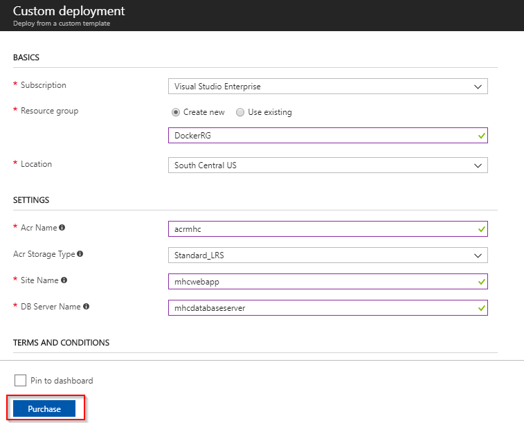

1. It takes approximately **3 to 4 minutes** to provision the environment. Click on **Go To resource group**.

   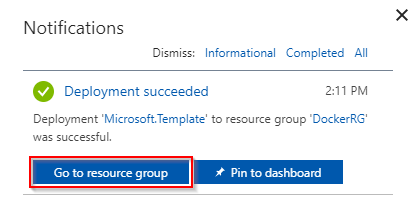

1. Below components are created post deployment.

    <table width="100%">
   <thead>
      <tr>
         <th width="50%"><b>Azure Components</b></th>
         <th><b>Description</b></th>
      </tr>
   </thead>
   <tr>
      <td><b>Azure Container Registry</b></td>
      <td>Used to store images privately</td>
   </tr>
   <tr>
      <td> <b>Storage Account</b></td>
      <td>Container Registry resides in this storage account</td>
   </tr>
   <tr>
      <td> <b>App Service</b></td>
      <td>Docker images are deployed to containers in this App Service</td>
   </tr>
   <tr>
      <td> <b>App Service Plan</b></td>
      <td>Resource where App Service resides</td>
   </tr>
   <tr>
      <td> <b>SQL Server</b> </td>
      <td>SQL Server to host database</td>
   </tr>
   <tr>
      <td> <b>SQL database</b> </td>
      <td>SQL database to host MyHealthClinic data</td>
   </tr>
   </table>

   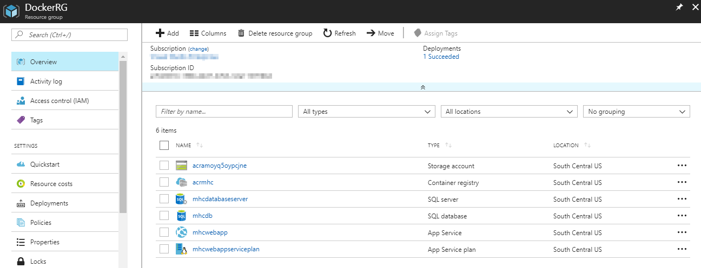

1. Click on **mhcdb** SQL database. Note down the **Server name**.

   

1. Go back to your resource group. Click on container registry and note down the **Login server** name. We need these details later in Exercise 2.

   

## Setting up the VSTS Project

1. Use [VSTS Demo Data Generator](https://vstsdemogenerator.azurewebsites.net/?name=Docker&templateid=77363) to provision a project on your VSTS account

    

1. Provide a Project Name, and click on Create Project.

   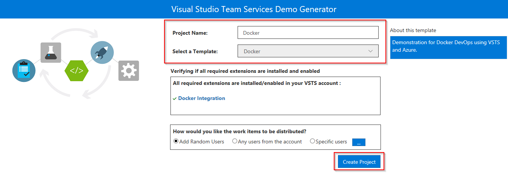

1. Once the project is provisioned, click the **URL** to navigate to the project.

   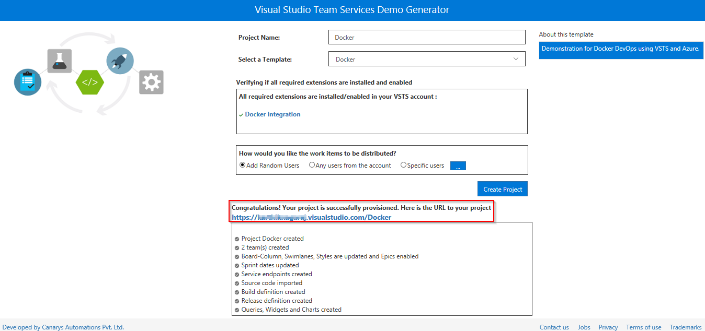

## Exercise 1: Endpoint Creation

Since the connections are not established during project provisioning, we will manually create the Azure endpoint.

1. In VSTS, navigate to **Services** by clicking on the gear icon , and click on **+ New Service Endpoint**. Select **Azure Resource Manager**. Specify **Connection name**, select your **Subscription** from the dropdown and click **OK**. We use this endpoint to connect **VSTS** and **Azure**.

   

   You will be prompted to authorize this connection with Azure credentials. Disable pop-up blocker in your browser if you see a blank screen after clicking OK, and retry the step.

## Exercise 2: Configure CI-CD

 Now that the connection is established, we will manually map the Azure endpoint and Azure Container Registry to build and release definitions. We will also deploy the dacpac to mhcdb database so that the schema and data is set for the backend.

>Note : If you encounter an error - ***TFS.WebApi.Exception: Page not found*** for Azure tasks in the build/ release definition, you can fix this by typing a random text in the Azure Subscription field and click the **Refresh** icon next to it. Once the field is refreshed, you can select the endpoint from the drop down. This is due to a recent change in the VSTS Release Management API. We are working on updating VSTS Demo Generator to resolve this issue.

1. Go to **Builds** under **Build and Release** tab, **Edit** the build definition **Docker**.

   

1. In the **Process** section, update **Azure subscription** and **Azure Container Registry** with the endpoint component from the dropdown. (use arrow keys to choose Azure Container Registry for the first time). Click **Save**.

   

   |Tasks|Usage|
   |-----|-----|
   | **Run services**| prepares suitable environment by restoring required packages|
   | **Build services**| builds images specified in a **docker-compose.yml** file with registry-qualified names and additional tags such as **$(Build.BuildId)**|
   | **Push services**| pushes images specified in a **docker-compose.yml** file, with multiple tags, to container registry|
   | **Lock services**| pulls image from default tag **latest** in container registry and verifies if uploaded image is up to date|
   | **Copy Files**| used to copy files from source to destination folder using match patterns|
   | **Publish Build Artifacts**| used to share the build artifacts|

1. Go to **Releases** under **Build & Release** tab, **Edit** the release definition **Docker** and select **Tasks**.

   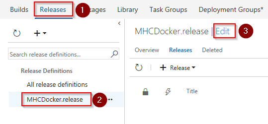

   

1. Description of three phases used in this release are given below:

   |Phases|Usage|
   |------|-----|
   |**DB deployment**|**Hosted VS2017** agent is used to create database schema along with pre-configured data in **mhcdb**|
   |**Agentless phase**| Manual intervention</b> is used to confirm if Azure Container Registry is manually mapped with Azure Web App|
   |**Web App deployment**|**Hosted Linux Preview** agent is used to pull image from ACR and deploy in Linux Web App|

1. Under **Execute Azure SQL:DacpacTask**, update **Azure Subscription** from the dropdown.

    **Execute Azure SQL:DacpacTask**: will deploy the dacpac to **mhcdb** database so that the schema and data is set for the backend.

    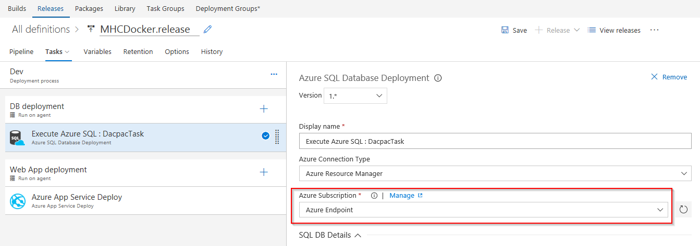

1. Under **Azure App Service Deploy** task, update **Azure subscription** and **Azure Service name** with the endpoint components from the dropdown.

    **Azure App Service Deploy** will pull the appropriate image corresponding to the BuildID from repository specified, and deploys the image to Linux App Service. **Manual Intervention** step is used to confirm if Azure Container Registry is mapped with Azure Web App.

    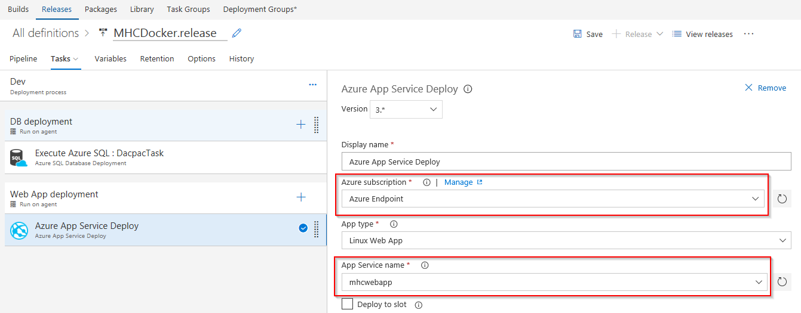

1. Click on **Variables** section, update **ACR** and **SQLserver** with the details noted earlier while setting up the environment. Click **Save**.

    

   >Note: **Database Name** is set to **mhcdb**, **Server Admin Login** is **sqladmin** and **Password** is **P2ssw0rd1234**.

## Exercise 3: Trigger CI-CD with Code Change

In this exercise, we will update the code to trigger CI-CD.

1. Go to **Files** under **Code** tab, and navigate to the below path to **Edit** the file **Index.cshtml**

   >Docker/src/MyHealth.Web/Views/Home/**Index.cshtml**

   

1. Go to line number **28**, update **JOIN US** to **JOIN US TODAY**, and click **Commit**.

    

1. Click **Commit** in the pop-up window.

    

1. Go to **Builds** tab. Click on the build number to see the build in progress.

    

    Build will generate and push the image to Azure Container Registry. After build completes, you will see the build summary.

    

1. Go to [Azure Portal](https://portal.azure.com), navigate to the **App Service** which was created at the beginning of this lab. Select **Docker Container** section. Under **Image Source** highlight **Azure Container Registry**. Select your **Registry** from the dropdown. Under **image** dropdown select **myhealth.web** and under **Tag** dropdown select **latest**. This is required to map Azure Container Registry with the Web App. Click **Save**.

    

    

1. To see generated images, go to your **Azure Container Registry** and navigate to **Repositories**.

    

1. Switch back to **Releases** in VSTS, and double click on latest release.

    

1. Navigate to **Logs** section to see the release in progress. It takes upto 4 to 5 minutes for dacpac deployment task to complete.

    

1. After dacpac deployment task is complete, click on **Resume or Reject**.

    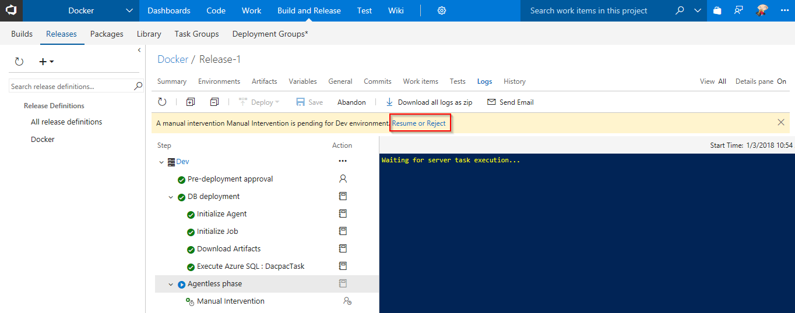

1. If you have already mapped the Azure Container Registry with the Azure Web App, give some comment and Click **Resume**. If not, go back to step 5 and then come back to this step.

    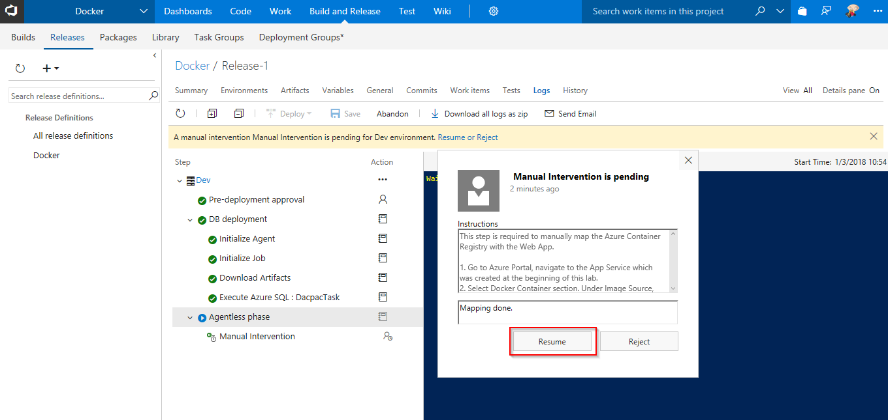

1. The release will deploy the image to App Service based on the **BuildID**, which is tagged with the image. You will see below summary once the release is complete.

    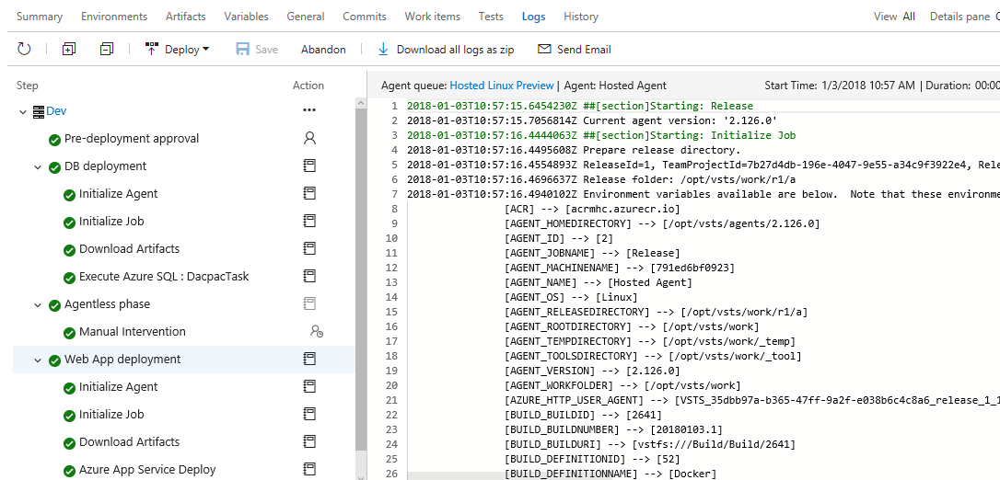

1. Switch back to [Azure Portal](https://portal.azure.com), navigate to the **Overview** section of your **App Service**. Click on the **URL** to see the changes in your app.

    

    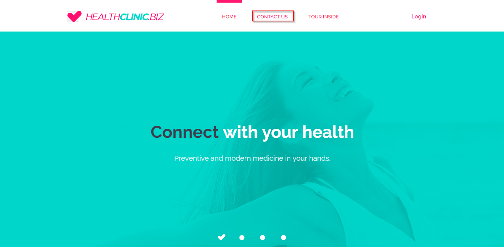

    Use below credentials to login to your **HealthClinic** app:

    **Username**: user

    **Password**: P2ssw0rd@1

## Summary

With **Visual Studio Team Services** and **Azure**, we can build DevOps for dockerized applications by leveraging docker capabilities enabled on VSTS Hosted Agents.

## Feedback

Please let [us](mailto:devopsdemos@microsoft.com) know if you have any feedback on this lab.