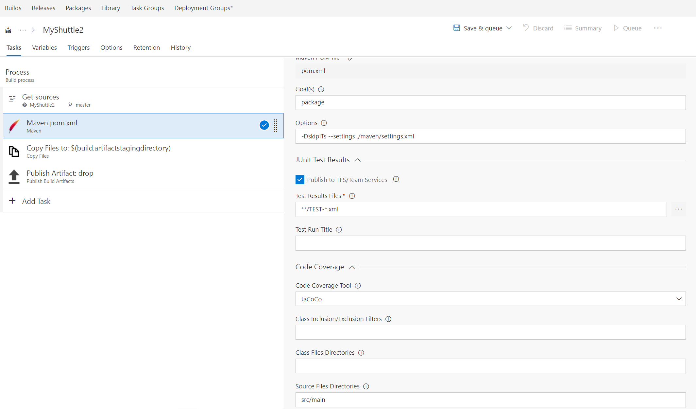
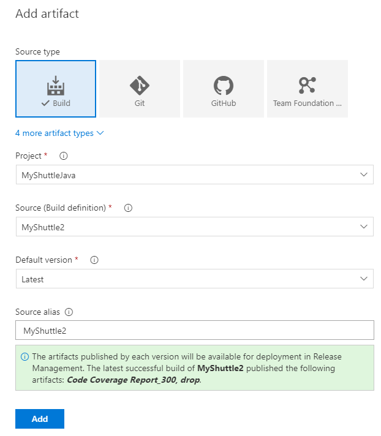
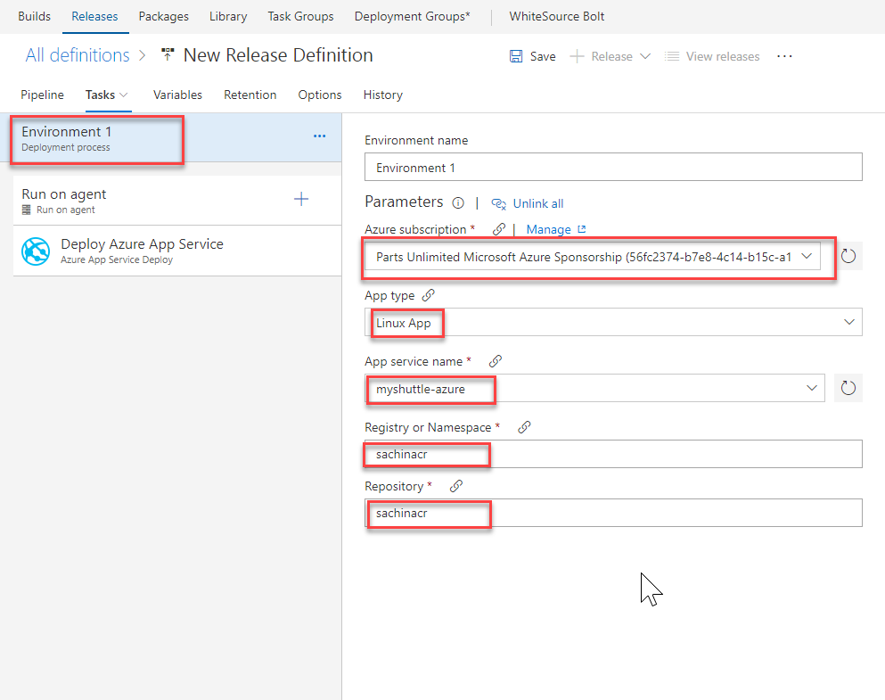
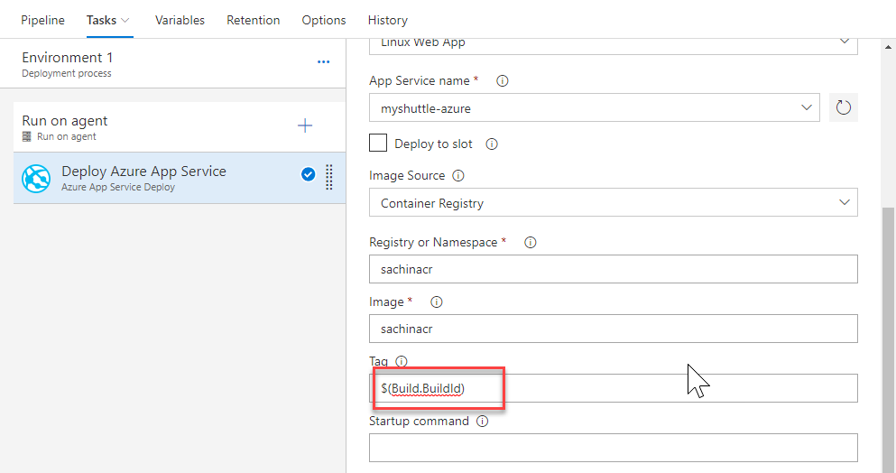

## Exercise 5:  Create a VSTS Build to Build Docker ../images/

In this task you will create a VSTS build definition that will create two containers (a mysql database container as well as a tomcat container for running the MyShuttle2 site). The build will publish the containers to the Azure Container Registry you just created.

1. In VSTS, from the **Build** hub, select and edit the **MyShuttle** build. This build definition contains a *maven* task to build the pom.xml file. The maven task has the following settings

    | Parameter | Value | Notes |
    | --------------- | ---------------------------- | ----------------------------------------------------------- |
    | Options | `-DskipITs --settings ./maven/settings.xml` | Skips integration tests during the build |
    |Code Coverage Tool | JaCoCo | Selects JaCoCo as the coverage tool |
    | Source Files Directory | `src/main` | Sets the source files directory for JaCoCo |

      

1. Then there is **Copy** and **Publish** tasks to copy the artifacts to the staging directory and publish to VSTS (or a file share).

1. Next we use the **Docker Compose** task to build and publish the ../images/. The settings of the Docker compose tasks are as follows:
    | Parameter | Value | Notes |
    | --------------- | ---------------------------- | ----------------------------------------------------------- |
    | Container Registry Type | Azure Container Registry | This is to connect to the Azure Container Registry you created earlier |
    | Azure Subscription | Your Azure subscription | The subscription that contains your registry |
    | Azure Container Registry | Your registry | Select the Azure Container registry you created earlier |
    | Additional Image Tags | `$(Build.BuildNumber)` | Sets a unique tag for each instance of the build |
    | Include Latest Tag | Check (set to true) | Adds the `latest` tag to the ../images/ produced by this build |

1. Click the "Save and Queue" button to save and queue this build.Make sure you are using the **Hosted Linux Agent** 

## Deploying to an Azure Web App for containers

In this exercise, we will setup a CD pipeline to deploy the web application to an Azure web app. First, let's create the Web App   

1. Sign into your [Azure Portal](https://portal.azure.com)

1. In the Azure Portal, choose **New, Web + Mobile** and then choose **Web App for Containers**

     

1. Provide a name for the new web app, select existing or create new resource group for the web app. Then select **Configure Container** to specify the source repository for the ../images/. Since we are using ACR to store the ../images/, select **Azure Container Registry**. Select the **Registry, Image and Tag** from the respective drop-downs.Select **OK** and then select **Create** to start provisioning the web app

    

1. Once the provisioning is complete, go to the web app properties page, and select the URL to browse the web app. You should see the default **Tomcat** page

1. Append **/myshuttledev** the web application context path for the app, to the URL to get to the MyShuttle login page. For example if your web app URL is `https://myshuttle-azure.azurewebsites.net/` , then your URL to the login page is `https://myshuttle-azure.azurewebsites.net/myshuttledev/`

    

    We could configure *Continuous Deployment* to deploy the web app is updated when a new image is pushed to the registry, within the Azure portal itself. However, setting up a VSTS CD pipeline will provide more flexibility and additional controls (approvals, release gates, etc.) for application deployment

1. Back in VSTS, select **Releases** from the **Build and Release**hub. Select **+** and then **Create Release Definition**

1. Select **Pipeline**. Click **+Add** to add the artifacts. Select **Build** for the source type. Select the **Project**, **Source** and the **Default version**.  Finally select **Add** to save the settings

1. Select the **Azure App Service Deployment** template and click **Apply**
    

1. Open the environment. Select **Environment 1** and configure as follows

    * Pick the Azure subscription
    * Select **Linux App** for the **App Type**
    * Select the **App Service** that you created
    * Enter the **Container Registry** name and then
    * Enter ***Web*** for the **Repository**

    

1. Select the **Deploy Azure App Service** task and make sure that these settings are reflected correctly. Note that the task allows you to specify the **Tag** that you want to pull. This will allow you to achieve end-to-end traceability from code to deployment by using a build-specific tag for each deployment. For example, with the Docker build tasks  you can tag your ../images/ with the Build.ID for each deployment.

    

1. Select **Save** and then click **+ Release | Create Release** to start a new release

1. Check the artifact version you want to use and then select **Create**

1. Wait for the release is complete and then navigate to the URL `http://{your web app name}.azurewebsites.net/myshuttledev`. You should be able to see the login page

<table width="100%">
<tr width="100%">
<td align="left"><a href="../packagemgmt/">Prev: Package Management with VSTS</a></td>
<td align="right"><a href="../vstsproject/">Next: Setting up Database</a></td>
</tr>
</table>