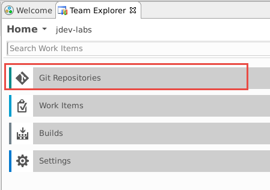
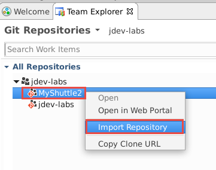
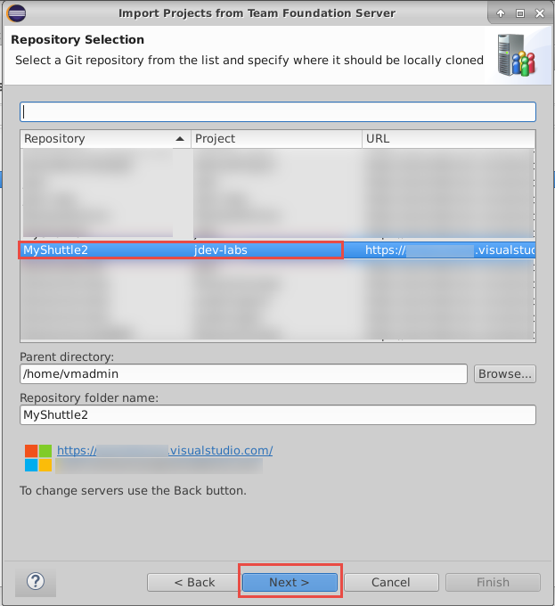
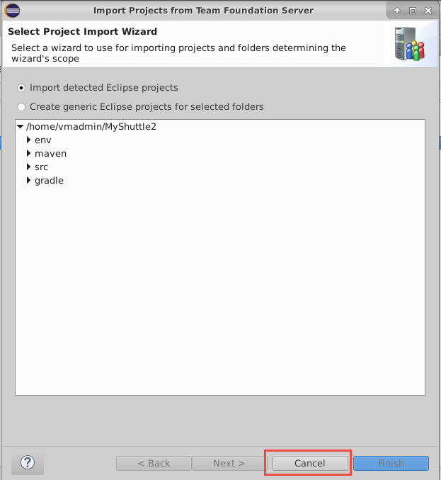
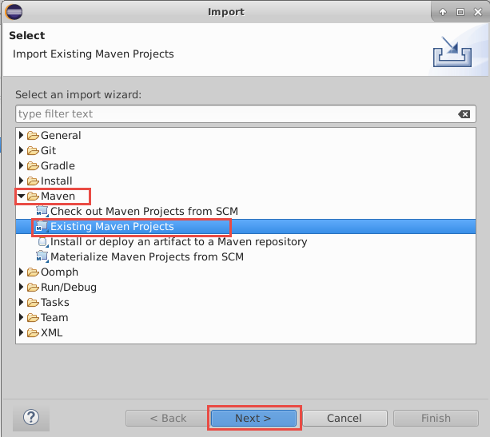
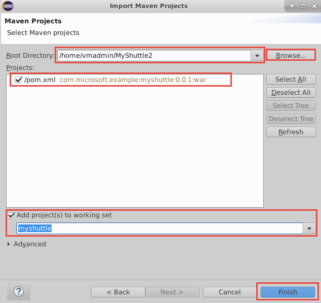
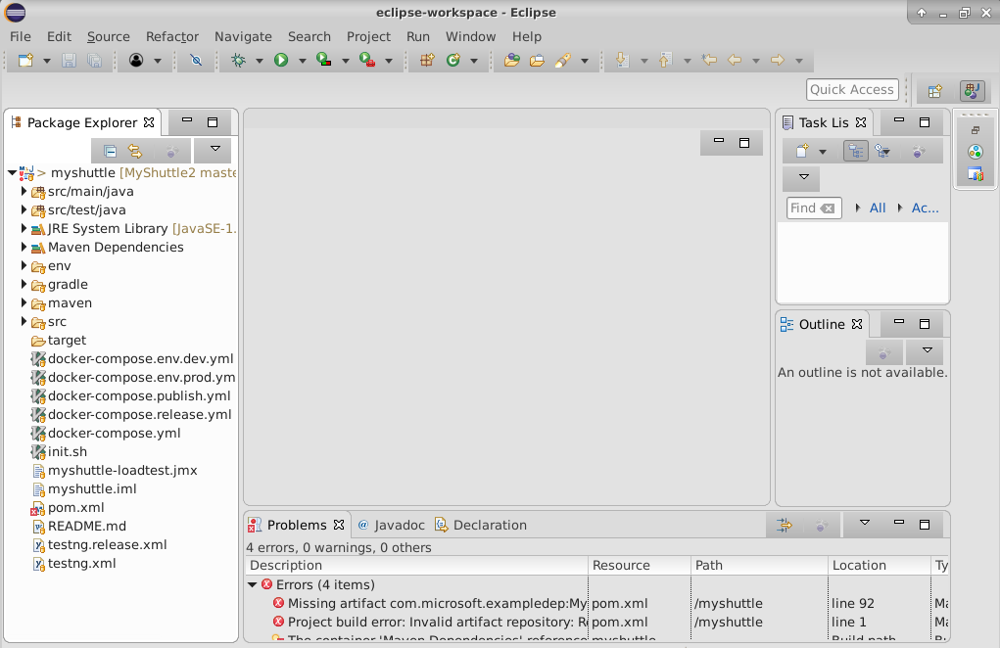

# Working with Eclipse - Clone MyShuttle from VSTS with Eclipse

Next, we will clone the two repositories that we have in VSTS, to a local Git repository. First, lets clone the repo that has the web application code.

1. In the **Team Explorer** panel, choose **Git Repositories**. This will list all the Git repositories in the project. 

1. Right-click the **MyShuttle2** repo in the team project and select **Import Repository**

    

    

    Leave the defaults for the parent directory and repo folder name, then press the next button. This will clone the repo onto the VM.  

    

1. We do not have any saved Eclipse projects in the repo. So, we can close the wizard now. We will instead import the project as a Maven project instead of Eclipse project. In the **"Import Projects from Team Foundation Server"** window, click the **Cancel** button.

    

1. The code has been cloned to the local repo. We can import from there. In Eclipse, choose **File -> Import...** to open the *Import* window. In the Import window, expand the Maven folder and choose **Existing Maven projects**. Then press the Next button. 

    

    For the root directory, click on the Browse button or type in the root directory path of /home/vmadmin/MyShuttle2. The pom.xml file should appear under projects to indicate the Maven project. Additionally, click the checkbox next to **Add project(s) to working set** to add myshuttle to the working set to access in the Package Explorer window as a separate project. Then click the Finish button

    

1. Click on **Window -> Show View -> Package Explorer** in the toolbar at the top of Eclipse to view the myshuttle project in Eclipse in Package Explorer (You may have to minimize other windows to view the Package Explorer view cleanly)

    

    > **Note**: The project will not currently compile and there may be build errors temporarily, since it has a dependency on a library (MyShuttleCalc) that it cannot resolve. You will fix this in the Package Management exercise.

### Exercise 3b: Clone the MyShuttleCalc repository

1. Repeat cloning a repository for MyShuttleCalc. Select the **MyShuttleCalc** repo in the team project and right-click the repo and select **Import Repository** 
  
1. Leave the defaults for the parent directory and repo folder name, then press the next button. This will clone the repo onto the VM. In the **Import Projects from Team Foundation Server** window, click the **Cance**l button. We will instead import the project as a Maven project instead of Eclipse project. 

1. Select **File -> Import...** to open the *Import* window. 1. In the Import window, expand the Maven folder and choose "Existing Maven projects." Then press the Next button. 

    >For the root directory, click on the Browse button or type in the root directory path of /home/vmadmin/MyShuttleCalc. The pom.xml file should appear under projects to indicate the Maven project. Additionally, click the checkbox next to "Add project(s) to working set" to add myshuttle to the working set to access in the Package Explorer window as a separate project. Then click the Finish button. 

1. Click on Window -> Show View -> Package Explorer in the toolbar at the top of Eclipse to view the myshuttle project in Eclipse in Package Explorer

    

<table width="100%">
<tr width="100%">
<td align="left"><a href="../vstsproject/">Prev: Setting up VSTS Project and Eclipse</a></td>
<td align="right"><a href="../packagemgmt/">Next: Package Management with VSTS</a></td>
</tr>
</table>
