# Overview 

In this exercise, you are going to see a typical end-to-end workflow for a Java developer. 

You should have completed the exercises in ["Working with Eclipse - Getting started"](../) labs to create a Team Project, set up Eclipse., configure a CI/CD pipeline to publish images to ACR and deploy the application to Azure Web App. 

In this scenario, you will open the running MyShuttle application and discover a bug. You will then use the [Exploratory Testing extension](https://marketplace.visualstudio.com/items?itemName=ms.vss-exploratorytesting-web) to create a Bug work item in VSTS. You will then branch the code for fixing the bug. Once the bug is fixed on the branch, you will merge the code in via a Pull Request and code review. This will then automatically queue the build/release pipeline and your fix will be deployed.


## Install the Exploratory Testing Extension for Chrome

In this task you will install the [Exploratory Testing extension](https://marketplace.visualstudio.com/items?itemName=ms.vss-exploratorytesting-web) into Chrome.

1. Open chrome and navigate to `https://chrome.google.com/webstore`. Enter **exploratory testing** into the search box. Find the **Test & Feedback** extension from Microsoft Corporation and click **Add to Chrome**. Click **Install/Add Extension** in the dialog.

    

1. Once installed, a beaker icon appears in the top right of the Chrome toolbar. Click it to open the UI.

1. Click on the gear icon to open the settings. Select **Connected** and enter your VSTS account URL and click Next. Then select your team project and expand it and select the default team (which should have the same name as your team project). Click Save.

    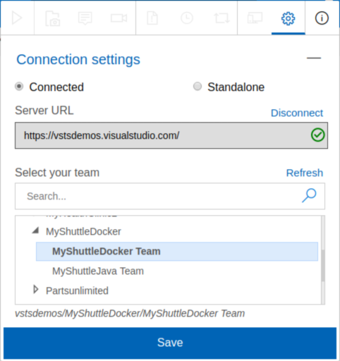

    > **Note**: Your team name may be different

## Log a Bug using the Exploratory Test Extension

In this task you will start a test session, discover a bug in the MyShuttle app and log it to VSTS.

1. In the Test extension toolbar of the Exploratory Test extension, click the Play icon to start a testing session.

    

    > **Note**: The test extension is now recording all of your interactions. You can see the test icon beaker has a green dot indicating that a session is currently running.

1. Enter `http://{your web app name}/myshuttledev` in the toolbar to navigate to the application. Enter `fred` for the username and `fredpassword` for the password and click **Log In**.

    

1. On the Dashboard page, click **Access Your Fare History** to navigate to the fare history page.

1. If you look at the totals for the Fare and Driver column in the table, you will note that the total for the driver column is incorrect.

1. Click the Test Extension beaker icon and click the Camera icon (capture image).

    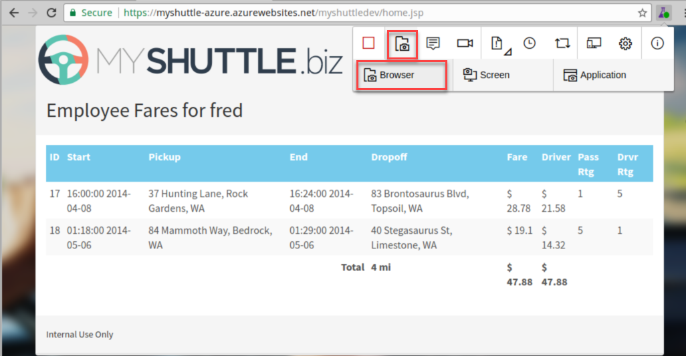

1. Capture the grid with the incorrect total. Annotate the image appropriately and click the tick (accept) icon.

    

1. Click the Test Extension beaker icon and click flyout (lower right) of the icon with the page and exclamation mark (new bug). From the menu click Create bug.

    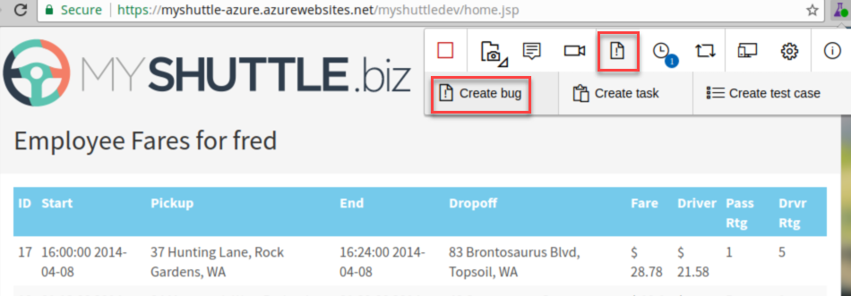

1. In the title box, enter **"Driver total incorrect"** and click **Save**.

    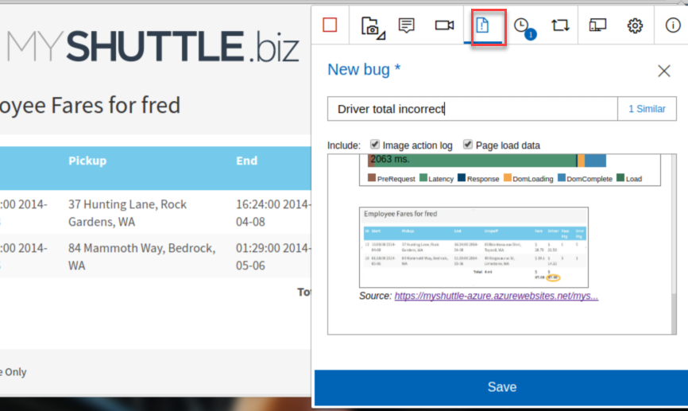

    > **Note**: All the pages visited, notes, screenshots and other information from the test session is included as details for the Bug, so you don't have to add these details manually. You also should see a button next to the title box reading "0 Similar". VSTS checks to see if there are bugs already logged with similar titles, therefore minimizing duplicate bugs being logged.

1. Once the bug has been created, click the Stop button in the Test Extension toolbar to end the test session.

1. Navigate to your VSTS team project. Click **Work** to navigate to the Work Hub. In the search toolbar, enter "driver" into the Search Work Items box and press enter or click the magnifying glass icon.

    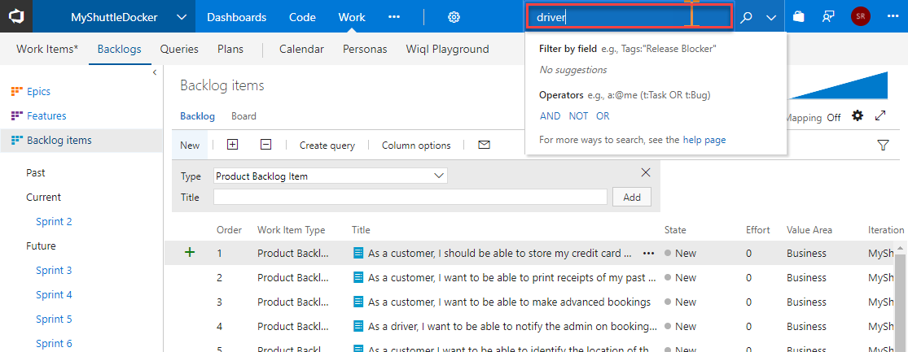

1. You should see the Bug that you logged. Take a moment to look at the Repro Steps.

    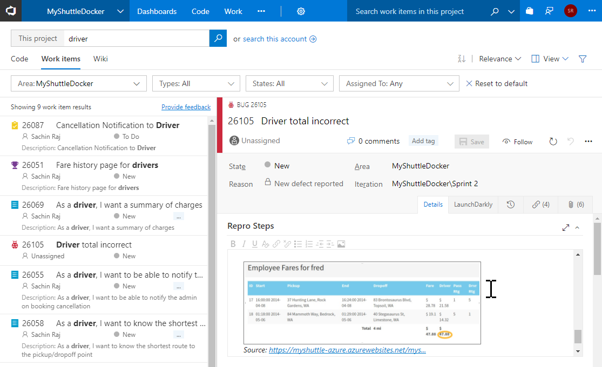

1. Assign the Bug to yourself and change the state to Active. Click Save.

Now it's time to roll up your sleeves to detect the cause and find a fix for the bug. But before we make any code changes, we will create a **branch**. In the world of Git, teams generally create new branches to isolate changes for a feature or a bug fix from the master branch and other work. They commit and push changes to the remote branch. The changes are then presented to the rest of the team for review and approval via **Pull Request** before they are merged to the *master* branch. You can establish requirements for all pull requests to ensure high quality code and protect important branches with **Branch Policy**

## Configure Branch Policies


In this task you will enforce quality on the master branch by creating branch policies

1. Go to your VSTS Team Project and select **Code** to open the Code Hub.

1. Select **Branches** and choose the ellipsis `"..."` of the master branch and select **Branch Policies**

    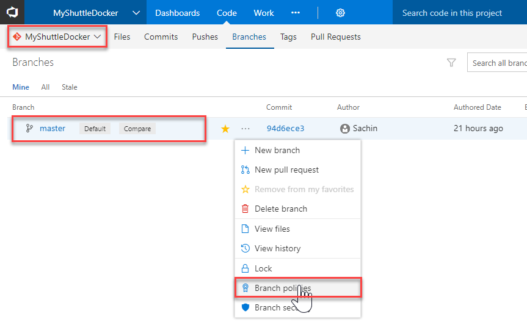

1. Check **Check for linked work items** and set the radio to **Required**

1. Under **Build validation**, click **Add build policy** and select **MyShuttleDocker-Maven-CI** from the list of build definitions and click **Save**.

    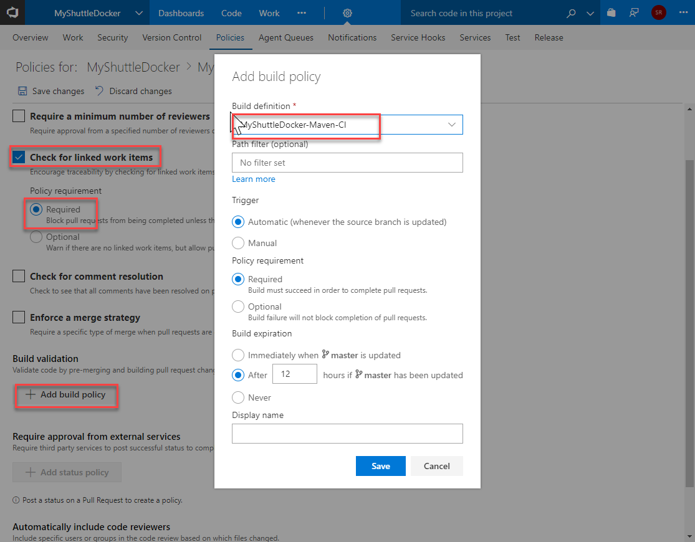

    > **Note**: You can enforce other policy options like comment resolution and minumum number of reviewers, as well as specify the merge options (like squashing). You can also add default reviewers.

## Fix the Bug

In this task you will create a branch of the code to fix the Bug. You will then checkout the branch, fix the bug and commit the code. You will then create a Pull Request to merge the fix into master and see that this triggers the CI/CD pipeline to automatically deploy the fix to the dev environment.

1. Open Eclipse if it is not already open. Open the MyShuttleDocker project.

1. In *Team Explorer* change the drop down to **Work Items**.  If the dropdown does not show work items connect to your VSTS account via the Team Explorer Home page.

1. If there are no queries saved in VSTS, a query can be created in Eclipse. Right-click on the My Queries folder and select **New Query**

    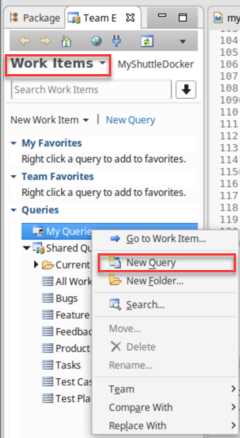

1. You can run an existing query by double clicking it. Double click **Bugs** to get the list of bugs in the project.  

    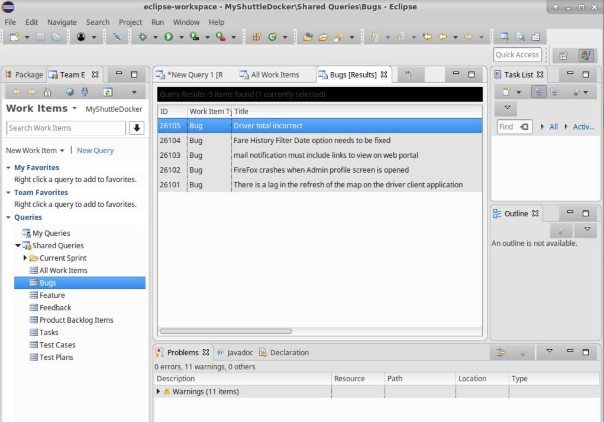

1. Select the **Driver total incorrect** bug and double click to open it in a browser.

1. You can select the Ellipsis  button `...` and select **New branch...** to create a new branch.

    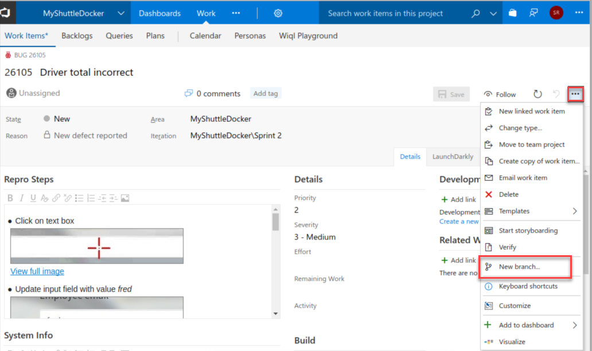

1. In the dialog, change the branch name to **fixtotalsBug** and click Create Branch. Note that the work item is already associated to the branch
    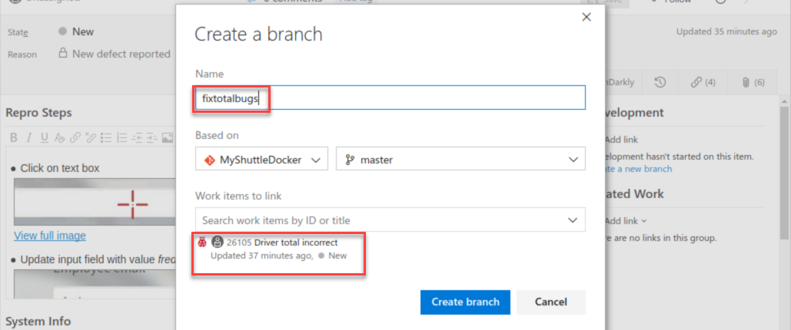

1. Return back to Eclipse. In the project view of Eclipse,right-select the project, choose **Team** and then **pull** to fetch the latest changes, including the new branch just created.
    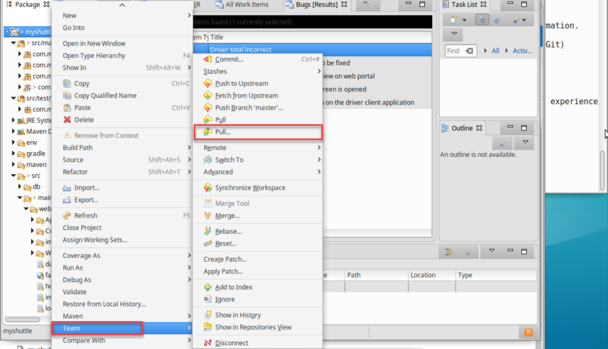

1. To switch to the new branch, select **Team** , **Switch to...**  and select **Other**
    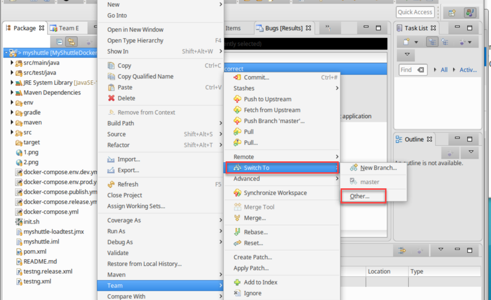

1. Expand **Remote Tracking** and select the **origin/fixtotalbugs** branch and click **Check Out**. In the resulting dialog, choose **Check out as a local branch** option.  

 1. Browse to `src/main/java/com.microsoft.example.servlet` and open the LoginServlet class.

1. Around line 35, you will see what is causing the bug: the `totalDriverFee` is being calculated but the `driverFeeTotal` session attribute is being set to `totalFareForDriver` (this looks like a classic copy/paste error).

    Change this line of code:
    ```java
        session.setAttribute("driverFeeTotal", totalFareforDriver);
    ```
    to
    ```java
        session.setAttribute("driverFeeTotal", totalDriverFee);
    ```

1. Save the file.  Commit the changes by right clicking the file and selecting Team->Commit. Enter "Fixing totals bug #{ID of bug}" as the commit message. By putting the # symbol followed by an ID of a work item in a commit message, VSTS will automatically associate the work item with the commit when it's pushed to VSTS. In the example of the screenshot, the ID is #26105. Click "Commit and Push" to push the changes to VSTS.

    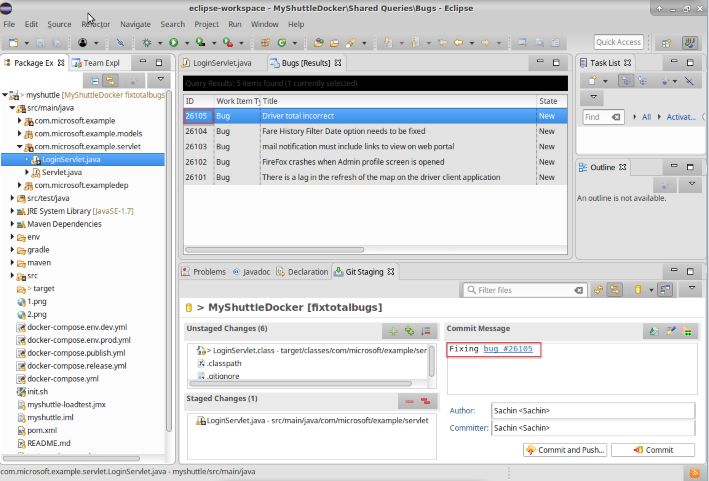

1. If a window pops up that prompts for credentials, use the following values:

    | Name | Value |
    |---|---|
    | User | `_VSTS_Code_Access_Token` |
    | Password | `{PAT that you have created earlier for the demo generator}` |

    

    In the Push commits dialog click the Push button.

1. Now that the fix has been pushed to VSTS on a branch, you can create a *Pull Request. This will be done in VSTS following the standard process for pull requests. Under the **Code** hub, click on Files in the MyShuttleDocker repo and there should be a notification that you updated the `fixtotalsBug` branch. Click the link next to it, **Create a pull request**

    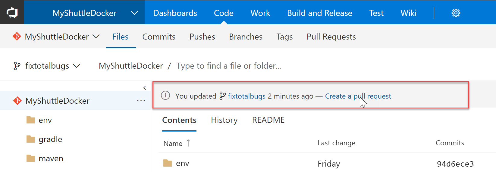

1. Then, in the pull request panel, click "Create" to create the pull request. Note that the bug is associated with the commit.

    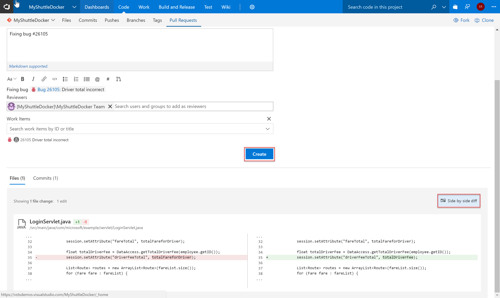

1. Once the PR has been created, right-click it in the PR list and click Open in Browser. You should see that the build is running (this is the build mandated by the Branch Policy you set up earlier).

    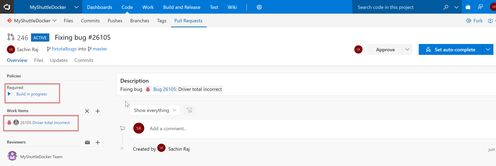

    > **Note**: If there was a merge conflict, VSTS would warn you on the overview page. If there is no warning to this effect, then Git will be able to auto-merge the PR into the target branch.

    > **Note**: You configured the release to only trigger when successful builds off the master branch are available. Since this build is not building from the master branch, these changes will not yet be deployed.

1. Click on the Files tab to open the file compare. Note the changes.

    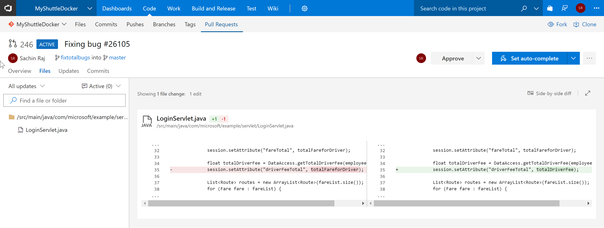

    > **Note**: You can comment on code or files in the PR and have conversations with the team throughout the review process.

1. Click **Approve** to approve the pull request.

1. Now that the policies have been fulfilled, you can complete the PR which will merge the changes into *master* (the target branch). Click **Complete** to do the merge.

1. In the dialog, accept the defaults and click **Complete merge**

    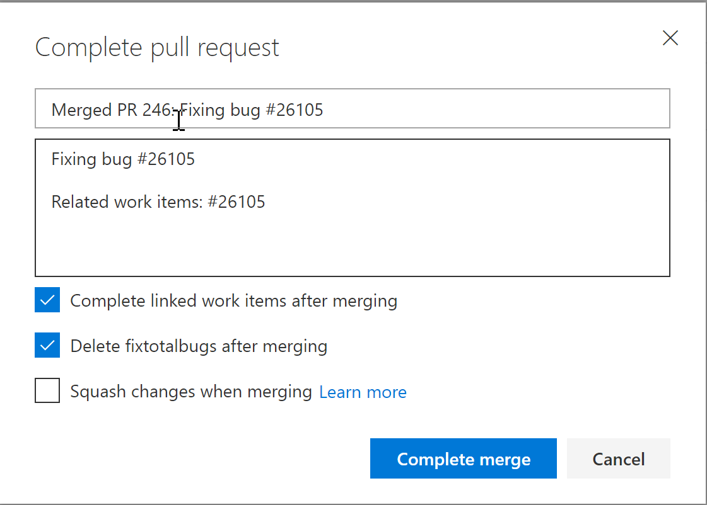

1. The PR completion triggers a new build off the master branch, which in turn will trigger a release. _It also transitions the Bug work item to Resolved_.

1. Click on Builds to watch your build. When the build completes, you will see the unit test and code coverage results as well as SonarQube analysis and quality gates (if you have configured SonarQube integration).

1. Click on Releases and open the latest release which should have triggered off the PR merge build completion event.

1. On the Release Summary page, you will see the linked Bug work item.

    

1. Click on commits to see the incoming commits for this release. There is the commit to fix the bug as well as the commit to merge into master.

    

1. Click on the Tests tab to see the test results. The UI tests should be passing.

1. Open the MyShuttle2 app by navigating to `http://localhost:8081/myshuttledev`. Log in again and verify that the totals column is correct and the Bug has been fixed.

    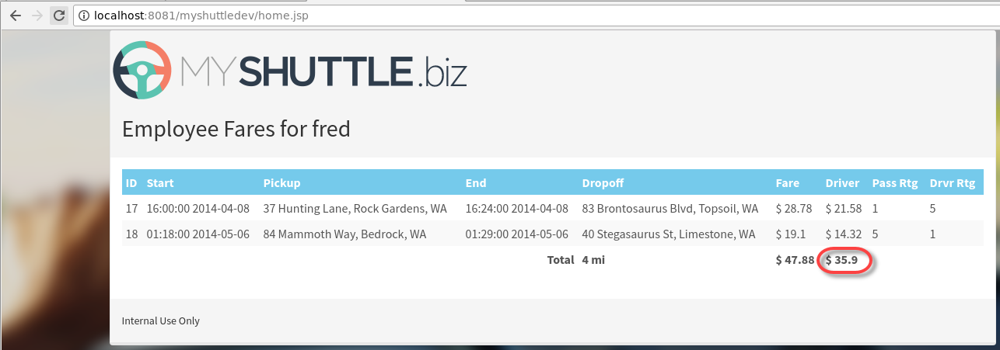