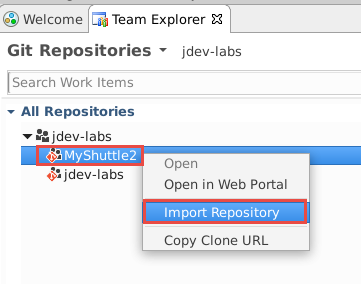
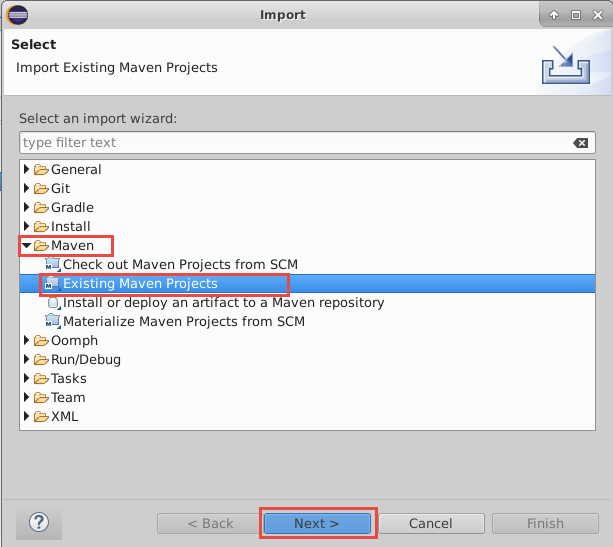
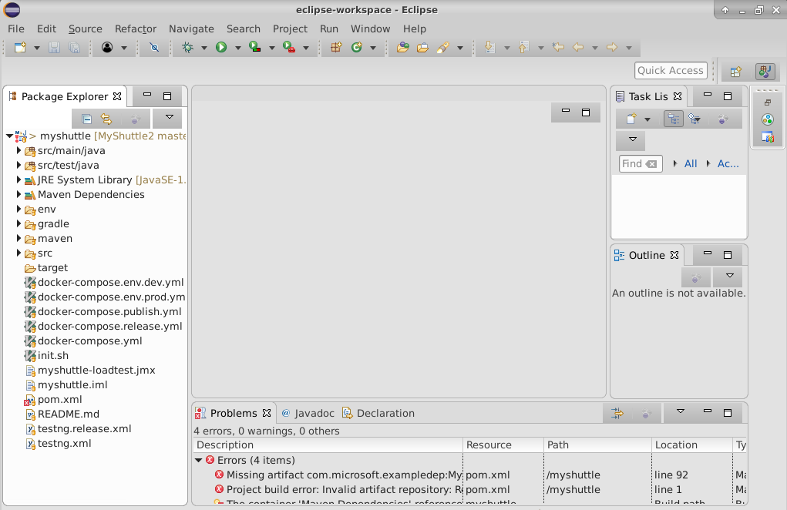

# Working with Eclipse

VSTS helps teams modernize their application development lifecycle and go from idea to deployment with continuous integration, testing, and deployment for any app targeting any platform. VSTS works with (m)any development tool including Visual Studio, Eclipse, IntelliJ, Android Studio, XCode, etc., to make it easy for developers to use VSTS.

In this exercise, you are going to see a typical end-to-end workflow for a Java developer using VSTS and working with Eclipse. We will use a hypothetical customer called MyShuttle that provides a portal for its drivers to access travel history and see fares collected. This is a  Java application built on JSP/Servlet technology running on Apache Tomcat and using MySQL as the database. We will develop this on a Ubuntu desktop station and we will deploy the app on Azure.


* Provision a VSTS project with some sample data and users 
* Install and explore how **Team Explorer Everywhere** the Eclipse plugin for VSTS
* Setup a CI and CD pipeline to deploy a Java application
* Run a automated test to test and detect issues
* Fix and redeploy the application

## Pre-requisites

1. **Microsoft Azure Account**: You need a valid and active azure account for the labs.

1. You need a **Visual Studio Team Services Account** and [Personal Access Token](https://docs.microsoft.com/en-us/vsts/accounts/use-personal-access-tokens-to-authenticate)

## Provisioning Eclipse VM on Azure

1. Click on **Deploy to Azure** to provision a Ubuntu VM pre-installed with Eclipse, Docker, Jenkins, and all other software required to run this lab.

    <a href="https://portal.azure.com/#create/Microsoft.Template/uri/https%3A%2F%2Fraw.githubusercontent.com%2FMicrosoft%2FVSTS-DevOps-Labs%2Feclipse%2Feclipse%2Farm%2520template%2Fazuredeploy.json" target="_blank">

</a>

1. Once the machine is provisioned, you can RDP to it. From the **Overview** tab of the virtual machine, note the **DNS Name** and use *Remote Desktop* program to connect and log in

1. Log in with the user name and password provided.

## Setting up the project

1. Use <a href="https://vstsdemogenerator.azurewebsites.net" target="_blank">VSTS Demo Data Generator</a> to provision a project on your VSTS account.

1. Select the **MyShuttle-Java** for the template.

 

3. Provide a project name and click **Create Project** to start provisioning. Once the project is provisioned, select the URL to navigate to the project that you provisioned.

1. You will see the work items, source code and CI/CD definitions already populated by the demo generator.

1. Navigate to the **Code** hub. You will notice we have two code repositories - one with the same name as your project that contains the code for the web application and the other one **myshuttlecalc** that has the code for a fare calculator which we will package and use it in the web application.

## Setting up Eclipse

1. RDP in to the virtual machine

1. Click on the Eclipse icon in the toolbar to open the Eclipse Java IDE.

    

1. The first time you run Eclipse, it will prompt for default workspace. Click on the box **"Use this as the default and do not ask again"** to use the default workspace on startup.

1. We will install **Team Explorer Everywhere (TEE)**, the official plug-in for Eclipse from Microsoft to connect VSTS/TFS with Eclipse-based IDE on any platform. It is supported on Linux, Mac OS X, and Windows and is compatible with IDEs that are based on Eclipse 4.2 to 4.6. 

    With Team Explorer Everywhere, you can:

    * Browse and clone Git repositories
    * Full access to TFS Version Control (TFVC), including check-in, check-out, sync, branch, merge, diff, etc.
    * Full access to TFS agile tools, work items, and issue tracking capabilities allowing you to add, edit and query work items
    * Full access to TFS Build functionality including the ability to create Ant, Maven, or Gradle based builds in TFS, publish JUnit test results into TFS or Visual Studio Team Services, monitor progress and handle results. This is fully compatible with all Team Foundation Build types including Gated Check-in and Continuous Integration Builds.

1. When the Welcome dialog appears, on the **Help** | **Menu** select **Install New Software**.

1. Choose the **Add** button to add a new repository.  Use Team Explorer Everywhere as the name. The location of the update site is http://dl.microsoft.com/eclipse

    

1. Choose the **OK** button.

1. In the list of features in the Install dialog box, select the check box that corresponds to the Team Explorer Everywhere plugin. If you don't see this option, use the pull-down menu for "Work with:" and find the update site URL you just entered in the list and select it, then select the check box beside the plug-in mentioned above.

    

1.  Choose **Next** to follow the wizard to complelete the installation. 

1.  Eclipse will need to restart. When Eclipse restarts,choose **Windows > Show View** and select **Other...**

1. Search for Team Explorer, select the Team Explorer View, and select OK.

    

1. Choose the radio button next to "Connect to a Team Foundation Server or Team Services account" then type in the name of the VSTS account (`https://{your-account-name}.visualstudio.com`) and press the Next button. 

    The "Follow the instructions to complete sign-in" window will pop up. Click on the hyperlink to be redirected to the Device Login page in a browser on the VM (may have a black background for security purposes). 

1. Log in to authenticate yourself. 

1. Return back to Eclipse, press the OK button in the device login window. The VSTS account should now show up in the list of servers to connect to. Press the "Close" button to close the current window.

    

## Clone MyShuttle2 from VSTS with Eclipse
-----------------------------

1. Once you have authenticated, click the "Next" button in the "Add Existing Team Project Window" to view team projects in VSTS.

    

    Select the appropriate team project in Eclipse, then press the "Finish" button.
    
    In the Team Explorer Everywhere panel, choose the "Git Repositories" panel, then select the MyShuttle2 repo in the team project and right-click the repo and select "Import Repository."  

    

    

    Leave the defaults for the parent directory and repo folder name, then press the next button. This will clone the repo onto the VM.  

    

    In the "Import Projects from Team Foundation Server" window, click the cancel button. We will instead import the project as a Maven project instead of Eclipse project. 

    

1. In Eclipse, navigate to File -> Import... to open the "Import" window.

    

    In the Import window, expand the Maven folder and choose "Existing Maven projects." Then press the Next button. 

    

    For the root directory, click on the Browse button or type in the root directory path of /home/vmadmin/MyShuttle2. The pom.xml file should appear under projects to indicate the Maven project. Additionally, click the checkbox next to "Add project(s) to working set" to add myshuttle to the working set to access in the Package Explorer window as a separate project. Then click the Finish button. 

    

1. Click on Window -> Show View -> Package Explorer in the toolbar at the top of Eclipse to view the myshuttle project in Eclipse in Package Explorer. You may have to minimize other windows to view the Package Explorer view cleanly. 

    

> **Note**: The project will not currently compile and there may be build errors temporarily, since it has a dependency on a library (MyShuttleCalc) that it cannot resolve. You will fix this in the Package Management lab.

Clone MyShuttleCalc from VSTS with Eclipse
-----------------------------

1. Repeat cloning a repository for MyShuttleCalc.

1. In the Team Explorer Everywhere panel, choose the "Git Repositories" panel, then select the MyShuttleCalc repo in the team project and right-click the repo and select "Import Repository."  

    

    

    Leave the defaults for the parent directory and repo folder name, then press the next button. This will clone the repo onto the VM.  

    

    In the "Import Projects from Team Foundation Server" window, click the cancel button. We will instead import the project as a Maven project instead of Eclipse project. 

     

1. In Eclipse, navigate to File -> Import... to open the "Import" window.

    

1. In the Import window, expand the Maven folder and choose "Existing Maven projects." Then press the Next button. 

    

    For the root directory, click on the Browse button or type in the root directory path of /home/vmadmin/MyShuttleCalc. The pom.xml file should appear under projects to indicate the Maven project. Additionally, click the checkbox next to "Add project(s) to working set" to add myshuttle to the working set to access in the Package Explorer window as a separate project. Then click the Finish button. 

    

    1. Click on Window -> Show View -> Package Explorer in the toolbar at the top of Eclipse to view the myshuttle project in Eclipse in Package Explorer. You may have to minimize other windows to view the Package Explorer view cleanly. 

    

In this task you will install the [Exploratory Testing extension](https://marketplace.visualstudio.com/items?itemName=ms.vss-exploratorytesting-web) into Chrome.

1. Open chrome and navigate to `https://chrome.google.com/webstore`. Enter "exploratory testing" into the search box. Find the "Test & Feedback" extension from Microsoft Corporation and click "Add to Chrome". Click Install in the dialog.

   

1. Once installed, a beaker icon appears in the top right of the Chrome toolbar. Click it to open the UI.

1. Click on the gear icon to open the settings. Select "Connected" and enter your VSTS account URL and click Next.

    

1. Select your team project and expand it and select the default team (which should have the same name as your team project). Click Save.

    

    > **Note**: Your team name may be different

## Configure Branch Policies

In this task you will enforce quality on the master branch by creating branch policies.

1. In Chrome, connect to your VSTS Team Project. Click on Code to open the Code Hub.

1. Click the Repo dropdown and select "Manage Repositories".

    

1. In the tree, expand the MyShuttle2 repo and click on the master branch. Click the Branch Policies tab.

    

1. Check the Protect this branch checkbox.

1. Check "Check for linked work items" and set the radio to required.

1. Under Build validation, click Add build policy. Select MyShuttle2 from the list of build definitions and click Save.

    

    > **Note**: You can enforce other policy options like comment resolution and minumum number of reviewers, as well as specify the merge options (like squashing). You can also add default reviewers.

## Log a Bug using the Exploratory Test Extension

In this task you will start a test session, discover a bug in the MyShuttle app and log it to VSTS.

1. In the Test extension toolbar of the Exploratory Test extension, click the Play icon to start a testing session.

    

    > **Note**: The test extension is now recording all of your interactions. You can see the test icon beaker has a green dot indicating that a session is currently running.

1. Enter `http://localhost:8081/myshuttledev` in the toolbar to navigate to the application. Enter `fred` for the username and `fredpassword` for the password and click Log In.

    

1. On the Dashboard page, click "Access Your Fare History" to navigate to the fare history page.

1. If you look at the totals for the Fare and Driver column in the table, you will note that the total for the driver column is incorrect.

1. Click the Test Extension beaker icon and click the Camera icon (capture image).

    

1. Capture the grid with the incorrect total. Annotate the image appropriately and click the tick (accept) icon.

    

1. Click the Test Extension beaker icon and click flyout (lower right) of the icon with the page and exclamation mark (new bug). From the menu click Create bug.

    

1. In the title box, enter "Driver total incorrect" and click Save.

    

    > **Note**: All the pages visited, notes, screenshots and other information from the test session is included as details for the Bug, so you don't have to add these details manually. You also should see a button next to the title box reading "0 Similar". VSTS checks to see if there are bugs already logged with similar titles, therefore minimizing duplicate bugs being logged.

1. Once the bug has been created, click the Stop button in the Test Extension toolbar to end the test session.

1. Navigate to your VSTS team project. Click Work to navigate to the Work Hub. In the toolbar, enter "driver" into the Search Work Items box and press enter or click the magnifying glass icon.

    

1. You should see the Bug that you logged. Take a moment to look at the Repro Steps.

    

1. Assign the Bug to yourself and change the state to Active. Click Save.

    

## Fix the Bug

In this task you will create a branch of the code to fix the Bug. You will then checkout the branch, fix the bug and commit the code. You will then create a Pull Request to merge the fix into master and see that this triggers the CI/CD pipeline to automatically deploy the fix to the dev environment.

>Note: Use the personal access token (PAT) generated from the "Set up a Docker Build" lab that should be located at: `home/vmadmin/pat.txt`. Otherwise, follow the instructions from that lab again to generate a new PAT.

1. Open Eclipse if it is not already open. Open the MyShuttle2 project.

1. In Team Explorer change the drop down to "Work Items".  If the dropdown does not show work items connect to your VSTS account via the Team Explorer Home page.

1. If there are no queries saved in VSTS, a query can be created in Eclipse (but not saved at this time). Right-click on the My Queries folder and select "New Query."

    

1. Run an existing query by double clicking it to find the bug. Or, right click in the New Query panel and select "Run Query." The output of the query will show the bug. Note the ID value of the bug.

    

    > **Note**: If you do not see the bug, ensure that it is assigned to you, since by default only work items assigned to you will appear in the work item list.

1. Create a new branch

    

1. In the dialog, change the branch name to "totalsBug" and click Create.

    

1. In the project view of Eclipse, browse to `src/main/java/com.microsoft.example.servlet` and open the LoginServlet class.

1. Around line 35, you will see what is causing the bug: the `totalDriverFee` is being calculated but the `driverFeeTotal` session attribute is being set to `totalFareForDriver` (this looks like a classic copy/paste error).

    Change this line of code:
    ```java
        session.setAttribute("driverFeeTotal", totalFareforDriver);
    ```
    to
    ```java
        session.setAttribute("driverFeeTotal", totalDriverFee);
    ```

1. Commit your changes by right clicking the file and selecting Team->Commit. Enter "Fixing totals bug #{ID of bug}" as the commit message. By putting the # symbol followed by an ID of a work item in a commit message, VSTS will automatically associate the work item with the commit when it's pushed to VSTS. In the example of the screenshot, the ID is #698. Click "Commit and Push" to push the changes to VSTS.

    

1. If a window pops up that prompts for credentials, use the following values:

    | Name | Value |
    |---|---|
    | User | `_VSTS_Code_Access_Token` |
    | Password | `{PAT that you copied earlier}` |

    

    In the Push commits dialog click the Push button.

1. Now that the fix has been pushed to VSTS on a branch, you can create a Pull Request. This will be done in VSTS following the standard process for pull requests. Under the Code hub, click on Files in the MyShuttle2 repo and there should be a notification that you updated the `totalsBug` branch. Click the link next to it, "Create a pull request."

    

1. Then, in the pull request panel, click "Create" to create the pull request. Note that the bug is associated with the commit.

    

1. Once the PR has been created, right-click it in the PR list and click Open in Browser. You should see that the build is running (this is the build mandated by the Branch Policy you set up earlier).

    

    > **Note**: If there was a merge conflict, VSTS would warn you on the overview page. If there is no warning to this effect, then Git will be able to auto-merge the PR into the target branch.

    > **Note**: You configured the release to only trigger when successful builds off the master branch are available. Since this build is not building from the master branch, these changes will not yet be deployed.

1. Click on the Files tab to open the file compare. Note the changes.

    

    > **Note**: You can comment on code or files in the PR and have conversations with the team throughout the review process.

1. Click Approve to approve the PR.

1. Now that the policies have been fulfilled, you can complete the PR which will merge the changes into master (the target branch). Click Complete to do the merge.

1. In the dialog, accept the defaults and click Complete merge.

    

1. The PR completion triggers a new build off the master branch, which in turn will trigger a release. _It also transitions the Bug work item to Resolved_.

1. Click on Builds to watch your build. When the build completes, you will see the unit test and code coverage results as well as SonarQube analysis and quality gates (if you have configured SonarQube integration).

1. Click on Releases and open the latest release which should have triggered off the PR merge build completion event.

1. On the Release Summary page, you will see the linked Bug work item.

    

1. Click on commits to see the incoming commits for this release. There is the commit to fix the bug as well as the commit to merge into master.

    

1. Click on the Tests tab to see the test results. The UI tests should be passing.

1. Open the MyShuttle2 app by navigating to `http://localhost:8081/myshuttledev`. Log in again and verify that the totals column is correct and the Bug has been fixed.

    