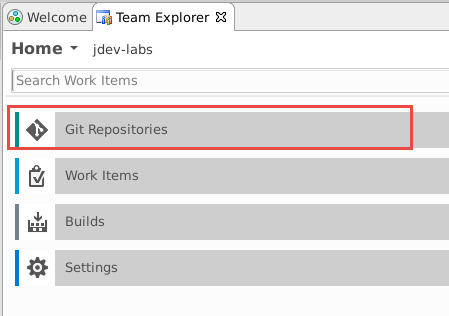
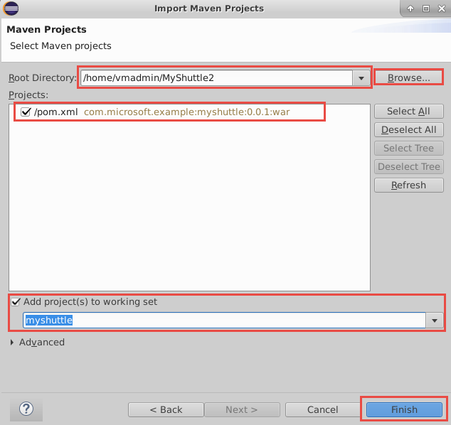
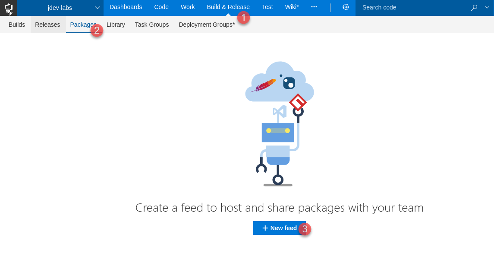
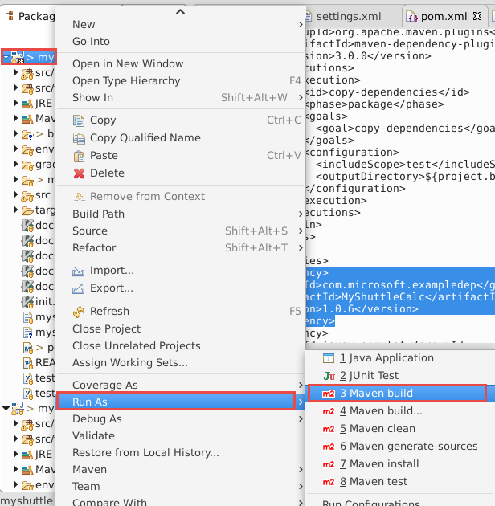
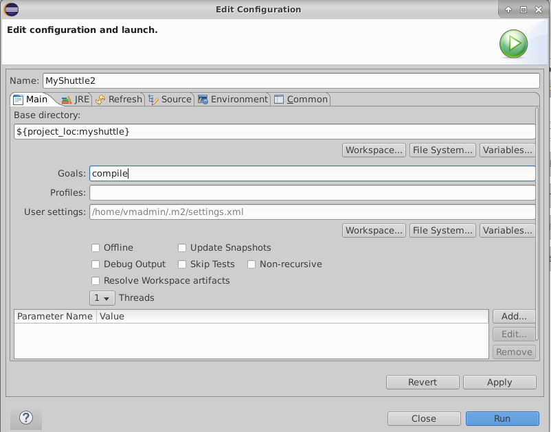

# Working with Eclipse

VSTS helps teams modernize their application development lifecycle and go from idea to deployment with continuous integration, testing, and deployment for any app targeting any platform. VSTS works with (m)any development tool including Visual Studio, Eclipse, IntelliJ, Android Studio, XCode, etc., to make it easy for developers to use VSTS.

This lab will walk you through a typical end-to-end workflow for a Java developer using VSTS and working with Eclipse. We will use a hypothetical customer called MyShuttle that provides a portal for its drivers to access travel history and see fares collected. This is a  Java application built on JSP/Servlet technology running on Apache Tomcat and using MySQL as the database. We will develop this on a Ubuntu desktop station and we will deploy the app on Azure.

In this lab, you will:
* Provision a VSTS project with some sample data and users 
* Install and explore how **Team Explorer Everywhere** the Eclipse plugin for VSTS
* Setup a CI and CD pipeline to deploy a Java application
* Run a automated test to test and detect issues
* Fix and redeploy the application

## Pre-requisites

1. **Microsoft Azure Account**: You need a valid and active azure account for the labs.

1. You need a **Visual Studio Team Services Account** and [Personal Access Token](https://docs.microsoft.com/en-us/vsts/accounts/use-personal-access-tokens-to-authenticate)

## Provisioning Eclipse VM on Azure

1. Click on **Deploy to Azure** to provision a Ubuntu VM pre-installed with Eclipse, Docker, Jenkins, and all other software required to run this lab.

    <a href="https://portal.azure.com/#create/Microsoft.Template/uri/https%3A%2F%2Fraw.githubusercontent.com%2FMicrosoft%2FVSTS-DevOps-Labs%2Feclipse%2Feclipse%2Farm%2520template%2Fazuredeploy.json" target="_blank">

</a>

1. Once the machine is provisioned, you can RDP to it. From the **Overview** tab of the virtual machine, note the **DNS Name** and use *Remote Desktop* program to connect and log in

1. Log in with the user name and password provided.

## Setting up the project

1. Use <a href="https://vstsdemogenerator.azurewebsites.net" target="_blank">VSTS Demo Data Generator</a> to provision a project on your VSTS account.

1. Select the **MyShuttle-Java** for the template.

 

3. Provide a project name and click **Create Project** to start provisioning. Once the project is provisioned, select the URL to navigate to the project that you provisioned.

1. You will see the work items, source code and CI/CD definitions already populated by the demo generator.
    

1. Navigate to the **Code** hub. You will notice we have two code repositories - one with the same name as your project that contains the code for the web application and the other one **MyShuttleCalc** - contains the code for a class library  that is used by the MyShuttle2 application

    


## Setting up Eclipse

1. If you have not already, log in to the virtual machine

1. Click on the Eclipse icon in the toolbar to open the Eclipse Java IDE.

    

1. The first time you run Eclipse, it will prompt for default workspace. Specify a folder and click on the box **"Use this as the default and do not ask again"** if you want to Eclipse remember it and not prompt it again.

1. We will install **Team Explorer Everywhere (TEE)**, the official plug-in for Eclipse from Microsoft to connect VSTS/TFS with Eclipse-based IDE on any platform. It is supported on Linux, Mac OS X, and Windows and is compatible with IDEs that are based on Eclipse 4.2 to 4.6. 

    With Team Explorer Everywhere, you can:

    * Browse and clone Git repositories
    * Full access to TFS Version Control (TFVC), including check-in, check-out, sync, branch, merge, diff, etc.
    * Full access to TFS agile tools, work items, and issue tracking capabilities allowing you to add, edit and query work items
    * Full access to TFS Build functionality including the ability to create Ant, Maven, or Gradle based builds in TFS, publish JUnit test results into TFS or Visual Studio Team Services, monitor progress and handle results. This is fully compatible with all Team Foundation Build types including Gated Check-in and Continuous Integration Builds.

1. After Eclipse has started, select **Help** | **Install New Software** to bring the install dialog page

1. Choose the **Add** button to add a new repository.  Use Team Explorer Everywhere as the name and specify *http://dl.microsoft.com/eclipse* for the location  

    

1. Choose the **OK** button.

1. In the list of features in the Install dialog box, select the check box that corresponds to the Team Explorer Everywhere plugin. 

    

    >**Note:** If you don't see this option, use the pull-down menu for "Work with:" and find the update site URL you just entered in the list and select it, then select the check box beside the plug-in mentioned above.

1.  Choose **Next** to follow the wizard to complelete the installation. 

1.  Eclipse will need to restart. When Eclipse restarts,choose **Windows > Show View** and select **Other...**

1. Search for Team Explorer, select the Team Explorer View, and select OK.

    

1. Choose the radio button next to "Connect to a Team Foundation Server or Team Services account" then type in the name of the VSTS account (`https://{your-account-name}.visualstudio.com`) and press the Next button. 

    The "Follow the instructions to complete sign-in" window will pop up. Click on the hyperlink to be redirected to the Device Login page in a browser on the VM (may have a black background for security purposes). 

1. Log in to authenticate yourself. 

1. Return back to Eclipse, press the OK button in the device login window. The VSTS account should now show up in the list of servers to connect to. Press the "Close" button to close the current window.

## Setup a private VSTS agent

1. In the VM, open a terminal by clicking on the **Terminal Emulator** icon in the toolbar

1. Enter the following command

    ```sh
    docker run -e VSTS_ACCOUNT=<account> -e VSTS_TOKEN=<pat> -v /var/run/docker.sock:/var/run/docker.sock --name vstsagent -it vsts/agent
    ```

    where:
    - _account_ is your VSTS account name (the bit before .visualstudio.com)
    - _pat_ is your PAT

    You should see a message indicating "Listening for Jobs":

    > **Note**: This starts a docker container (called vstsagent) that has a VSTS agent running inside it. The agent is connected to your VSTS account and has also mounted the VM Docker socket so that the container can perform Docker operations (like building containers). It is created from a Dockerfile (listed below) that installs PhantomJS for running headless Selenium tests and configures Docker certs and environment variables. You can move this terminal to the side since the container is running interactively, so the prompt you are seeing is actually inside the container. Open a new terminal by clicking on the Terminal Emulator icon in the toolbar.

    ```dockerfile
    # Dockerfile for custom vsts agent image with phantomjd and docker config
    FROM microsoft/vsts-agent

    # install phantomjs
    RUN curl -L https://bitbucket.org/ariya/phantomjs/downloads/$PHANTOM.tar.bz2 > $PHANTOM.tar.bz2 && \
    tar xvjf $PHANTOM.tar.bz2 -C /usr/local/share && \
    ln -sf /usr/local/share/$PHANTOM/bin/phantomjs /usr/local/share/phantomjs && \
    ln -sf /usr/local/share/$PHANTOM/bin/phantomjs /usr/local/bin/phantomjs && \
    ln -sf /usr/local/share/$PHANTOM/bin/phantomjs /usr/bin/phantomjs
    RUN apt-get update && apt-get install libfontconfig -y

    # configure docker
    COPY .docker /root/.docker/
    ENV DOCKER_HOST=tcp://$HOSTNAME:2376 DOCKER_TLS_VERIFY=1
    ```

    > **Note**: `$HOSTNAME` is a variable that resolves in the setup script that executed when you set up your Azure VM.

1. If your container stops running for some reason, you can run the following commands to restart and attach to it:

    ```sh
    docker start vstsagent
    docker attach vstsagent
    ```


## Clone MyShuttle2 from VSTS with Eclipse

Next, we will clone the two repositories that we have in VSTS, to a local Git repository

1. In the Team Explorer Everywhere panel, choose **Git Repositories** and then select the **MyShuttle2** repo in the team project and right-click the repo and select **Import Repository**
    

    

    Leave the defaults for the parent directory and repo folder name, then press the next button. This will clone the repo onto the VM.  

    

1. In the **"Import Projects from Team Foundation Server"** window, click the **Cancel** button. We will instead import the project as a Maven project instead of Eclipse project. 

    

1. In Eclipse, navigate to **File -> Import...** to open the *Import* window. In the Import window, expand the Maven folder and choose *Existing Maven projects*. Then press the Next button. 

    

    For the root directory, click on the Browse button or type in the root directory path of /home/vmadmin/MyShuttle2. The pom.xml file should appear under projects to indicate the Maven project. Additionally, click the checkbox next to **Add project(s) to working set** to add myshuttle to the working set to access in the Package Explorer window as a separate project. Then click the Finish button. 

    

1. Click on Window -> Show View -> Package Explorer in the toolbar at the top of Eclipse to view the myshuttle project in Eclipse in Package Explorer. You may have to minimize other windows to view the Package Explorer view cleanly. 

    

> **Note**: The project will not currently compile and there may be build errors temporarily, since it has a dependency on a library (MyShuttleCalc) that it cannot resolve. You will fix this in the Package Management exercise.

1. Repeat cloning a repository for MyShuttleCalc. Select the **MyShuttleCalc** repo in the team project and right-click the repo and select **Import Repository** 
  
1. Leave the defaults for the parent directory and repo folder name, then press the next button. This will clone the repo onto the VM. In the **Import Projects from Team Foundation Server** window, click the **Cance**l button. We will instead import the project as a Maven project instead of Eclipse project. 

1. Select **File -> Import...** to open the *Import* window. 1. In the Import window, expand the Maven folder and choose "Existing Maven projects." Then press the Next button. 

    >For the root directory, click on the Browse button or type in the root directory path of /home/vmadmin/MyShuttleCalc. The pom.xml file should appear under projects to indicate the Maven project. Additionally, click the checkbox next to "Add project(s) to working set" to add myshuttle to the working set to access in the Package Explorer window as a separate project. Then click the Finish button. 

1. Click on Window -> Show View -> Package Explorer in the toolbar at the top of Eclipse to view the myshuttle project in Eclipse in Package Explorer

    

## Package Management with VSTS

Next, we will configure a VSTS build to publish the *MyShuttleCalc* package to a VSTS Maven Package feed so that it can be consumed by MyShuttle2 and any other applications that require the calculation code.

1. In VSTS, click on *Build & Release* and then Packages to go to the Package Hub. Click “+ New Feed” to create a new feed.

    

1. Enter “Maven” for the feed name and click “Create”.

1. Now have a feed that you can publish package to. Next we will create credentials for the Maven feed. In the Packages Hub, make sure you have selected the Maven feed and click **Connect to Feed**. In the left menu, click on **Maven**.

1. Click **Generate Maven Credentials** to create a credentials snippet. Click the *Copy to Clipboard* button to copy the snippet to the clipboard.

    

1. Back in Eclipse, open the `MyShuttleCala\maven\settings.xml`

1.  Delete the comment `<!-- paste maven package feed credentials section here !-->` and replace it with the snippet between the `<servers>` and `</servers>` tags so that the final result looks like this:

1. Press Ctrl-S (or File->Save) and save the file.

1. In VSTS, go back to the Connect to Feed dialog on your Maven feed. Click on the copy button in the section labeled `Add this feed to your project pom.xml inside the <repositories> tag`.

1. In your editor, open the `pom.xml` file. Update the `<repositories>` tag as well as the `<distributionManagement>` tag so that they point to your feed.

1.  Commit your changes to the repo.

1. **Important**: Copy the maven settings file to the .m2 directory so that local Maven operations will succeed by running the following command in a terminal:

    ```sh
    cp ~/MyShuttleCalc/maven/settings.xml ~/.m2/
    ```

1. **Important**: If you have the MyShuttle2 project already open in IntelliJ or Eclipse, close the instance of the IDE and reopen it.

## Publishing the MyShuttleCalc library to the Maven feed.

Next we will run the **MyShuttleCalc** build to build and publish the MyShuttleCalc library to the Maven feed

1. In VSTS, Click on the **Build & Release** Hub and then click **Builds**

1. Select **MyShuttleCalc**. This build definition contains *maven* task with the following settings

    Field | Value | Notes |
    |---|---|---|
    | Options | `--settings ./maven/settings.xml` | Required to authenticate when pushing the Maven package to the feed. |
    | Goal(s) | `deploy -Dbuildversion=$(Build.BuildNumber)` | Tell Maven to publish the package, passing in the build number |
    | Code Coverage Tool | `JaCoCo` | Change the code coverage format |
    | Source Files Directory | `src/main` | These files must be included in the coverage results |


1. Select **Queue new build...**.Accept the defaults to queue the build and wait for the build to complete

1. When the build completes successfully,  Navigate back to the Maven package feed. There you will see the *MyShuttleCalc* package.

## Consuming the Package

Next , we will update the pom.xml file for the MyShuttle2 application so that it can consume the MyShuttleCalc package from the Maven package feed.

1. In VSTS, click on the **Build & Release** hub, click on **Packages**and select the Maven feed. Click on **Connect to Feed**. Click on the *copy* button in the section labeled `Add this feed to your project pom.xml inside the <repositories> tag`.

    

1. Open the MyShuttle2 project. Click on the **pom.xml** file.

1. In the `<repositories>` element there is a reference to a Maven repo. Paste in the repository settings you got from VSTS.

1. Find the `<dependency>` with `<groupId>com.microsoft.exampledep</groupId>` and update the version number to match the version number of the MyShuttleCalc package in your package feed. This may look something like:

    ```xml
    ...
    <dependency>
      <groupId>com.microsoft.exampledep</groupId>
      <artifactId>MyShuttleCalc</artifactId>
      <version>1.0.6</version>
    </dependency>
    ...
    ```

1. Copy the maven settings file from the MyShuttleCalc project (you updated this file in another lab to include the authentication settings for the Maven package feed). Run the following command in a terminal:

    ```sh
    cp ~/MyShuttleCalc/maven/settings.xml ~/MyShuttle2/maven/


1. You may have to reload the Maven project to update the plugins and dependencies. You can do this by right-clicking on the `myshuttle` working set/project, then selecting **Maven -> Update Project**. Then, keep the checkbox for `myshuttle` checked and press the OK button.

    

1. Right-click on the `myshuttle` working set/project, then select Run As -> Maven build.

    

    In the configuration window, type in "compile" as the Maven Goal then press the Run button.

    

    >Note: Ensure that you have already copied the settings.xml file from MyShuttleCalc to the .m2 folder before you run this. Otherwise, you can specify the settings.xml file in MyShuttle2 by clicking on the "File System..." button to the right of the User settings field in the configuration window to reference a settings file other than in the default .m2 folder.

1. Commit and push your changes through Team Explorer Everywhere.

## Create a VSTS Build to Build Docker Images

In this task you will create a VSTS build definition that will create two containers (a mysql database container as well as a tomcat container for running the MyShuttle2 site). The build will publish the containers to the Azure Container Registry you just created.

1. In VSTS, from the **Build** hub, select and edit the **MyShuttle** build. This build definition contains a *maven* task to build the pom.xml file. The maven task has the following settings

    | Parameter | Value | Notes |
    | --------------- | ---------------------------- | ----------------------------------------------------------- |
    | Options | `-DskipITs --settings ./maven/settings.xml` | Skips integration tests during the build |
    | Server URL | `http://10.0.0.4:8080`  | Selects JaCoCo as the coverage tool |
    | Source Files Directory | `src/main` | Sets the source files directory for JaCoCo |

      

1. Then there is **Copy** and **Publish** tasks

1. Next we use the **Docker Compose** task to build and publish the images. The settings of the Docker compose tasks are as follows:
    | Parameter | Value | Notes |
    | --------------- | ---------------------------- | ----------------------------------------------------------- |
    | Container Registry Type | Azure Container Registry | This is to connect to the Azure Container Registry you created earlier |
    | Azure Subscription | Your Azure subscription | The subscription that contains your registry |
    | Azure Container Registry | Your registry | Select the Azure Container registry you created earlier |
    | Additional Image Tags | `$(Build.BuildNumber)` | Sets a unique tag for each instance of the build |
    | Include Latest Tag | Check (set to true) | Adds the `latest` tag to the images produced by this build |

1. Click the "Save and Queue" button to save and queue this build.