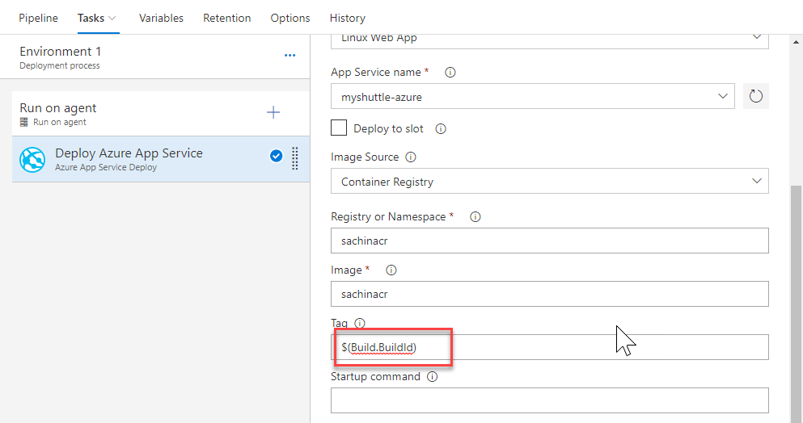

1. Select the **Deploy Azure App Service** task and make sure that these settings are reflected correctly. Note that the task allows you to specify the **Tag** that you want to pull. This will allow you to achieve end-to-end traceability from code to deployment by using a build-specific tag for each deployment. For example, with the Docker build tasks  you can tag your images with the Build.ID for each deployment.

    

1. Select **Save** and then click **+ Release | Create Release** to start a new release

1. Check the artifact version you want to use and then select **Create**

1. Wait for the release is complete and then navigate to the URL `http://{your web app name}.azurewebsites.net/myshuttledev`. You should be able to see the login page

<table width="100%">
<tr width="100%">
<td align="left"><a href="../buildandeploy/">Prev: Next: Setting Up CI/CD pipeline</a></td>
<td align="right"><a href="../vstsproject/">Next:Take the Challenge</a></td>
</tr>
</table>