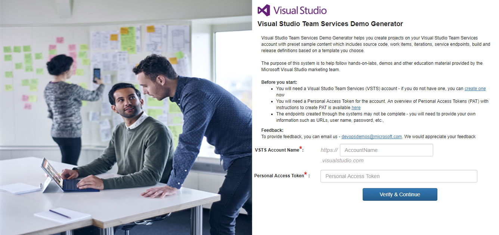
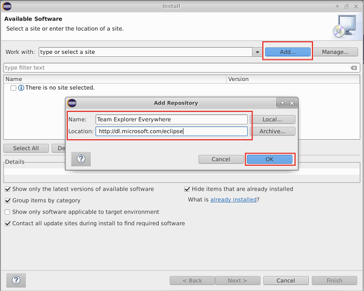

# Working with Eclipse -Setting up VSTS project

1. Use <a href="https://vstsdemogenerator.azurewebsites.net" target="_blank">VSTS Demo Data Generator</a> to provision a project on your VSTS account.

1. Select the **MyShuttle-Java** for the template.

 

3. Provide a project name and click **Create Project** to start provisioning. Once the project is provisioned, select the URL to navigate to the project that you provisioned.

1. You will see the work items, source code and CI/CD definitions already populated by the demo generator.
    

1. Navigate to the **Code** hub. You will notice we have two code repositories: One with the same name as your project - this repo contains the code for the web application and the other one **MyShuttleCalc** - contains the code for a class library  that is used by the MyShuttle application

    

Having VSTS setup, we will now log in to the virtual machine and set up Eclipse 

## Exercise 2: Setting up Eclipse

1. If you have not already, log in to the virtual machine

1. Click on the Eclipse icon in the toolbar to open the Eclipse Java IDE.

    

1. The first time you run Eclipse, it will prompt you to choose a workspace. Specify a folder and click on the box **"Use this as the default and do not ask again"** if you want to Eclipse use that as default and not prompt you again.

1. We will install **Team Explorer Everywhere (TEE)**, the official plug-in for Eclipse from Microsoft to connect VSTS/TFS with Eclipse-based IDE on any platform. It is supported on Linux, Mac OS X, and Windows and is compatible with IDEs that are based on Eclipse 4.2 to 4.6.

1. After Eclipse has started, select **Help** | **Install New Software** to bring the install dialog page

1. Choose the **Add** button to add a new repository.  Use Team Explorer Everywhere as the name and specify *http://dl.microsoft.com/eclipse* for the location  

    

1. Choose the **OK** button.

1. In the list of features in the Install dialog box, select the check box that corresponds to the Team Explorer Everywhere plugin. 

    

    >**Note:** If you don't see this option, use the pull-down menu for "Work with:" and find the update site URL you just entered in the list and select it, then select the check box beside the plug-in mentioned above.

1.  Choose **Next** to follow the wizard to complete the installation. 

1.  Eclipse will need to restart. When Eclipse restarts,choose **Windows > Show View** and select **Other...**

1. Search for **Team Explorer**, select the **Team Explorer** View, and select **OK**.

    

1. From the **Team Explorer** view, choose the radio button next to **Connect to a Team Foundation Server or Team Services account** then type in the name of the VSTS account (`https://{your-account-name}.visualstudio.com`) and press the **Next** button

    The "Follow the instructions to complete sign-in" window will pop up. Click on the hyperlink to be redirected to the Device Login page in a browser on the VM (Note that link may have a black background for security purposes). 

1. Log in to authenticate yourself. 

1. Return back to Eclipse, press the OK button in the device login window. The VSTS account should now show up in the list of servers to connect to. Press the **Close** button to close the current window.
<table width="100%">
<tr width="100%">
<td align="left"><a href="../">Prev: Overview </a></td>
<td align="right"><a href="../clonegit/">Next: Cloning Git Repositories</a></td>
</tr>
</table>